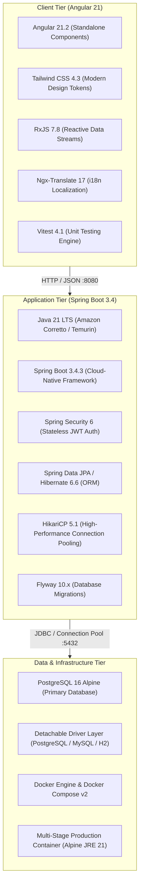

# Mio Wealth (Investman) — Master Architecture & Documentation

Welcome to **Mio Wealth** (Investman), a cloud-native, enterprise-grade personal finance, wealth portfolio, and investment management platform built with modern **Angular 21** and **Spring Boot 3.4 (Java 21)**.

---

## 🧭 System Documentation Index

The complete "X-ray" scan of the platform's architecture, database schema, security filters, and REST APIs is modularized in the [`/docs`](docs/) directory:

| Document | Scope | Description |
| :--- | :--- | :--- |
| [**1. High-Level Architecture**](docs/high-level-architecture.md) | High-Level | System topology, monorepo unified Fat JAR packaging, Docker container orchestration, detachable database abstraction, and SPA routing. |
| [**2. Low-Level Design**](docs/low-level-design.md) | Low-Level | Class hierarchies, package structures, Spring Data JPA repositories, DTO/VO mapping layers, and global exception handling. |
| [**3. Database Schema**](docs/database-schema.md) | Low-Level | Entity-Relationship (ER) diagram, table definitions, column types, foreign keys, cascades, JPA auditing, and Flyway migrations. |
| [**4. Security & Authentication**](docs/security-architecture.md) | Low & High | Spring Security 6 stateless filter chain, HMAC-SHA256 JWT lifecycle, BCrypt hashing, CORS, and session management. |
| [**5. REST API Reference**](docs/api-reference.md) | Specification | Complete API catalog with HTTP methods, paths, request/response payloads, validation rules, and status codes. |
| [**6. Sequence Diagrams**](docs/sequence-diagrams.md) | Workflows | Step-by-step Mermaid sequence flows for registration, login, portfolio calculation, investment creation, and session expiration. |
| [**7. API URL Design & Swagger Guide**](docs/api-design-and-swagger.md) | Standards & Tooling | REST URL conventions, View vs Data routing architecture, and how to generate interactive Swagger UI & OpenAPI 3 specs. |

---

## 🏗️ Technology Stack & Versions



---

## ⚡ Deployment & Running Modes

### 1. Production Mode (Docker Compose — Zero Host Dependencies)
The production standard encapsulates both the compiled Angular SPA and the Spring Boot backend into a single immutable, non-root Docker container:
```bash
# Start PostgreSQL and unified Spring Boot app
docker compose up -d --build
```
* **Application URL**: `http://localhost:8080`
* **PostgreSQL Port**: `localhost:5432`

### 2. Standalone Fat JAR Execution
```bash
# Compile Angular static files into Spring Boot static resources
cd imui && npm run build:static

# Package and run executable JAR
cd ../server
./mvnw clean package -DskipTests
java -jar target/investman-0.0.1-SNAPSHOT.jar
```

### 3. Local Development Mode (Decoupled Hot Reload)
* **Backend API**: Run Spring Boot server on port `8080` (`./mvnw spring-boot:run` from `server/`).
* **Frontend Dev Server**: Run Angular live-reload server on port `4200` (`npm start` from `imui/`). Requests to `/api/**` are seamlessly proxied to `http://localhost:8080` with zero CORS hurdles.

### 4. One-Click Windows Build & Run (`run.bat`)
Run the all-in-one script directly from the project root on Windows:
```cmd
run.bat
```
This automatically compiles the Angular UI, embeds static assets into `server/src/main/resources/static/`, and boots the Spring Boot backend server on `http://localhost:8080`.

