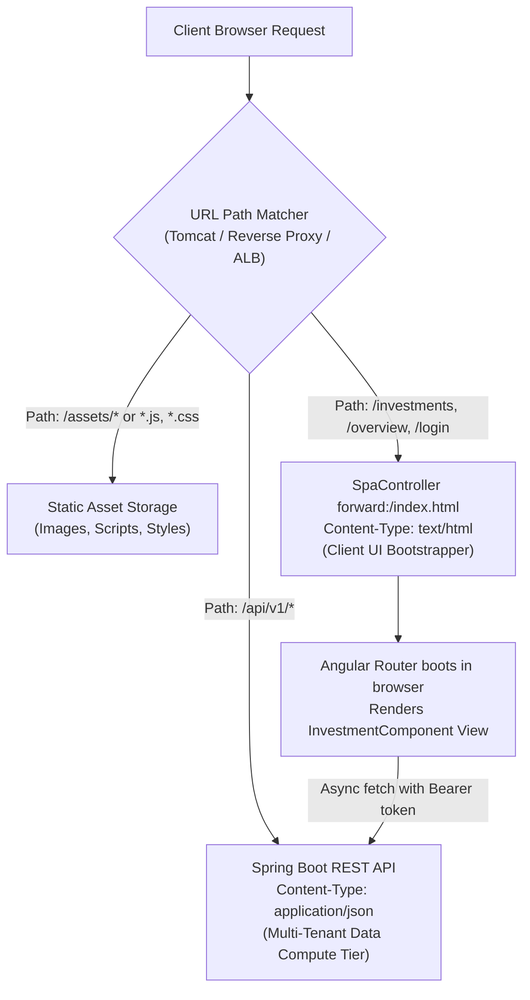
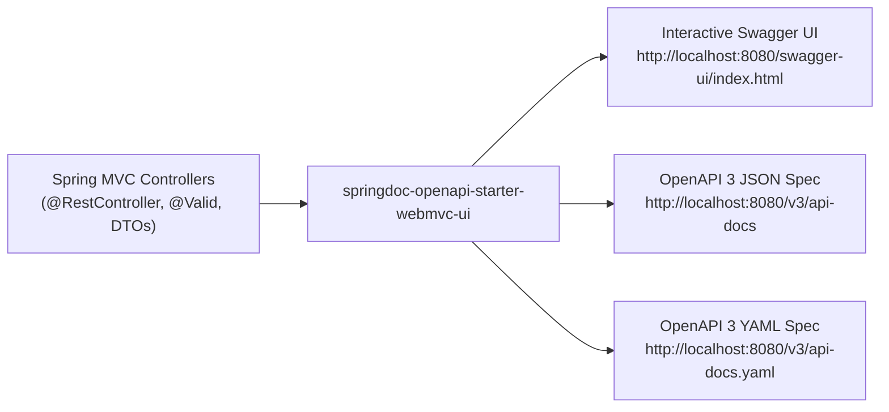

# API URL Design, Routing Architecture & Swagger / OpenAPI Guide

This document details the architectural rationale behind REST API URL design, explains why client browser URLs differ from backend API endpoints, and provides a complete guide for generating interactive and static **Swagger / OpenAPI 3** documentation in Spring Boot 3.4.

---

## 1. Why UI Browser URLs Differ from Backend API Endpoints

Separating UI view routes from API data endpoints is an essential cloud-native architectural standard.



### The 4 Core Architectural Reasons:

### 1. Collision Prevention (Data vs. View Ambiguity)
If the browser page was `http://localhost:8080/investments` and the backend endpoint was also `http://localhost:8080/investments`:
* When a user visits `http://localhost:8080/investments` in Chrome or bookmarks it, what should the server return?
  * **Option A**: HTML, CSS, and Angular JavaScript to render the interactive dashboard?
  * **Option B**: Raw JSON data array `[{"id": 1, "amount": 5000}]`?
* By isolating data under `/api/v1/`, there is **zero ambiguity**:
  * `http://localhost:8080/investments` $\rightarrow$ Returns the visual HTML/Angular web page.
  * `http://localhost:8080/api/v1/investments` $\rightarrow$ Returns structured JSON data.

### 2. Edge Routing & CDN Offloading
In production, a reverse proxy (Nginx, AWS Application Load Balancer, or Cloudflare) sits in front of the application:
```nginx
# Standard Production Reverse Proxy Routing Rule
location /api/ {
    proxy_pass http://backend-cluster;  # Forward to Spring Boot compute
}

location / {
    try_files $uri $uri/ /index.html;   # Serve cached static UI directly from edge/S3
}
```
Having all data endpoints prefixed with `/api` makes routing rules trivial and lightning-fast.

### 3. API Versioning Without Breaking Bookmarks
* Users bookmark UI routes like `/investments` or `/settings`. These URLs remain stable indefinitely.
* Backend APIs evolve with breaking data schemas (`/api/v1/investments` $\rightarrow$ `/api/v2/investments`). 
* The UI can upgrade behind the scenes without altering the user's browser URL.

### 4. Independent Security & Caching Policies
* UI static assets (`.js`, `.css`, `index.html`) have aggressive HTTP caching (`Cache-Control: public, max-age=31536000`).
* Financial API endpoints (`/api/v1/**`) enforce strict zero-cache security policies (`Cache-Control: no-store, no-cache`) and require JWT Bearer authorization.

---

## 2. Browser URLs vs. API Endpoints Mapping Matrix

| Feature / Intent | User Browser URL | Backend API Endpoint | Content Type | Auth Guard |
| :--- | :--- | :--- | :--- | :--- |
| **User Sign In** | `/login` | `POST /api/v1/auth/login` | `application/json` | Public |
| **User Sign Up** | `/signup` | `POST /api/v1/auth/register` | `application/json` | Public |
| **Category Catalog** | Background / Dropdowns | `GET /api/v1/categories?domain=...` | `application/json` | `Bearer <JWT>` |
| **Portfolio Overview** | `/overview` | `GET /api/v1/balance/summary` | `application/json` | `Bearer <JWT>` |
| **Holdings List** | `/investments` | `GET /api/v1/investments` | `application/json` | `Bearer <JWT>` |
| **Get Holding by ID** | `/investments` | `GET /api/v1/investments/{id}` | `application/json` | `Bearer <JWT>` |
| **Add Holding** | `/investments` (modal) | `POST /api/v1/investments` | `application/json` | `Bearer <JWT>` |
| **Edit Holding** | `/investments` (modal) | `PUT /api/v1/investments/{id}` | `application/json` | `Bearer <JWT>` |
| **Delete Holding** | `/investments` (modal) | `DELETE /api/v1/investments/{id}` | `application/json` | `Bearer <JWT>` |
| **Assets Breakdown** | `/balance` | `GET /api/v1/balance/assets` | `application/json` | `Bearer <JWT>` |
| **Liabilities Breakdown** | `/balance` | `GET /api/v1/balance/liabilities` | `application/json` | `Bearer <JWT>` |
| **Add Liability** | `/balance` (modal) | `POST /api/v1/balance/liabilities` | `application/json` | `Bearer <JWT>` |
| **Delete Liability** | `/balance` | `DELETE /api/v1/balance/liabilities/{id}` | `application/json` | `Bearer <JWT>` |
| **Account Settings** | `/settings` | `GET /api/v1/users/profile` | `application/json` | `Bearer <JWT>` |

---

## 3. REST API Design Conventions

All endpoints adhere to clean RESTful resource design:

| Principle | Our Implementation | Benefit |
| :--- | :--- | :--- |
| **Explicit API Prefix** | `/api/v1/**` | Distinguishes data endpoints from client routes and supports future non-breaking API evolution. |
| **Resource Nouns (Not Verbs)** | `/investments`, `/balance`, `/users` | Follows REST standards of modeling entities as resources rather than RPC action verbs. |
| **Pluralized Collections** | `/investments`, `/users` | Represents entity collections and sub-resources cleanly. |
| **HTTP Verb Semantics** | `GET` (read), `POST` (create), `PUT` (update), `DELETE` (remove) | Predictable, standard semantics across all operations. |
| **Stateless Authorization** | `Authorization: Bearer <token>` | Follows RFC 6750 for Bearer Token authorization with embedded tenant context. |

---

## 4. How to Generate Swagger / OpenAPI 3 Documentation

In Spring Boot 3.4 (Java 21), the standard framework is **Springdoc-OpenAPI v2**.



### Step 1: Add Springdoc Dependency to `server/pom.xml`

```xml
<!-- OpenAPI 3 & Interactive Swagger UI for Spring Boot 3 -->
<dependency>
    <groupId>org.springdoc</groupId>
    <artifactId>springdoc-openapi-starter-webmvc-ui</artifactId>
    <version>2.8.5</version>
</dependency>
```

---

### Step 2: Configure OpenAPI Metadata & JWT Security Scheme

Create `OpenApiConfiguration.java` in `server/src/main/java/com/greenboard/investman/config/OpenApiConfiguration.java`:

```java
package com.greenboard.investman.config;

import io.swagger.v3.oas.models.Components;
import io.swagger.v3.oas.models.OpenAPI;
import io.swagger.v3.oas.models.info.Contact;
import io.swagger.v3.oas.models.info.Info;
import io.swagger.v3.oas.models.info.License;
import io.swagger.v3.oas.models.security.SecurityRequirement;
import io.swagger.v3.oas.models.security.SecurityScheme;
import org.springframework.context.annotation.Bean;
import org.springframework.context.annotation.Configuration;

@Configuration
public class OpenApiConfiguration {

    @Bean
    public OpenAPI customOpenAPI() {
        final String securitySchemeName = "BearerAuth";
        return new OpenAPI()
                .info(new Info()
                        .title("Mio Wealth REST API")
                        .version("v1.0")
                        .description("Cloud-native financial management, asset tracking, and multi-tenant investment API.")
                        .contact(new Contact().name("Mio Wealth Engineering"))
                        .license(new License().name("Apache 2.0")))
                .addSecurityItem(new SecurityRequirement().addList(securitySchemeName))
                .components(new Components()
                        .addSecuritySchemes(securitySchemeName,
                                new SecurityScheme()
                                        .name(securitySchemeName)
                                        .type(SecurityScheme.Type.HTTP)
                                        .scheme("bearer")
                                        .bearerFormat("JWT")));
    }
}
```

---

### Step 3: Accessing the Generated Swagger Documentation

Once Spring Boot boots up (`docker compose up` or `./mvnw spring-boot:run`):

1. **Interactive Swagger UI**:
   * Open: **`http://localhost:8080/swagger-ui/index.html`**
   * Features: Interactive "Try it out" buttons, live payload validation, model schemas, and response testing.
2. **Raw OpenAPI 3 JSON Specification**:
   * Open: **`http://localhost:8080/v3/api-docs`**
3. **Raw OpenAPI 3 YAML Specification**:
   * Open: **`http://localhost:8080/v3/api-docs.yaml`**
