# Database Schema & Persistence Specification

This document provides the authoritative, field-by-field specification of the relational database schema, entity relationships, constraints, indexes, UUID primary keys, JPA auditing lifecycle, and Flyway migration architecture for **Mio Wealth**.

---

## 1. Entity-Relationship (ER) Diagram

```mermaid
erDiagram
    user_login ||--o| user_profile : "has profile (1:1)"
    user_profile ||--o{ user_address : "has addresses (1:N)"
    user_login ||--o{ investment : "owns investments (1:N)"
    user_login ||--o{ saving : "owns savings (1:N)"
    user_login ||--o{ liability : "owes liabilities (1:N)"
    user_login ||--o{ expense : "incurs expenses (1:N)"

    financial_category ||--o{ investment : "classifies (1:N)"
    financial_category ||--o{ saving : "classifies (1:N)"
    financial_category ||--o{ liability : "classifies (1:N)"
    financial_category ||--o{ expense : "classifies (1:N)"

    financial_category {
        varchar(50) code PK "Natural Primary Key (e.g. STOCKS, PF, HOME_LOAN)"
        varchar(20) domain "Domain Enum (INVESTMENT, SAVING, EXPENSE, LIABILITY)"
        varchar(100) name "Human-readable Display Name"
        varchar(255) description "Catalog Description"
    }

    user_login {
        varchar(36) user_id PK "UUID v4 Account Primary Key"
        varchar(100) username UK "Unique Account Login Name"
        varchar(255) password "BCrypt Encrypted Hash"
    }

    user_profile {
        varchar(36) user_profile_id PK "UUID v4 Surrogate ID"
        varchar(100) first_name "Required First Name"
        varchar(100) middle_name "Optional Middle Name"
        varchar(100) last_name "Required Last Name"
        varchar(150) email_id "Email Address"
        varchar(30) mobile_number "Phone Number"
        varchar(255) profile_picture "Avatar URL / Path"
        varchar(36) user_id FK "Unique Foreign Key to user_login"
        timestamp created_on "Audit Creation Timestamp"
        timestamp updated_on "Audit Last Modified Timestamp"
        timestamp last_login "Audit Last Login Timestamp"
    }

    user_address {
        varchar(36) address_id PK "UUID v4 Primary Key"
        varchar(255) line1 "Street Address Line 1"
        varchar(255) line2 "Apartment / Suite"
        varchar(100) city "City"
        varchar(100) state "State / Province"
        varchar(100) country "Country"
        varchar(20) postal_code "ZIP / Postal Code"
        varchar(36) user_profile_id FK "Foreign Key to user_profile"
    }

    investment {
        varchar(36) investment_id PK "UUID v4 Primary Key"
        varchar(36) user_id FK "Foreign Key to user_login"
        varchar(50) category_code FK "Foreign Key to financial_category"
        varchar(50) symbol "Ticker / Code (e.g. VTI, AAPL)"
        varchar(150) asset_name "Descriptive Name"
        double_precision amount "Total Valuation or Invested Principal"
        int quantity "Number of Units / Shares"
        double_precision unit_price "Purchase / Market Unit Price"
        timestamp investment_date "Transaction Date"
        varchar(50) action "BUY / SELL / HOLD"
        varchar(255) remarks "Notes or Context"
        varchar(255) tags "Tax & Planning Tags (e.g. #80C, #retirement)"
    }

    saving {
        varchar(36) saving_id PK "UUID v4 Primary Key"
        varchar(36) user_id FK "Foreign Key to user_login"
        varchar(50) category_code FK "Foreign Key to financial_category"
        varchar(150) institution_name "Bank / Fund Provider Name"
        varchar(50) account_number "Masked Account Number"
        double_precision amount "Liquid Savings Balance"
        timestamp saving_date "Date Recorded"
        varchar(50) action "DEPOSIT / WITHDRAW"
        varchar(255) remarks "Deposit Description"
        varchar(255) tags "Categorization Tags"
    }

    liability {
        varchar(36) liability_id PK "UUID v4 Primary Key"
        varchar(36) user_id FK "Foreign Key to user_login"
        varchar(50) category_code FK "Foreign Key to financial_category"
        varchar(150) name "Debt / Loan Name"
        double_precision amount "Outstanding Balance"
        double_precision interest_rate "Annual Percentage Rate (APR %)"
        timestamp created_at "Creation Date"
        varchar(255) tags "Debt Tags (e.g. #tax_deductible)"
    }

    expense {
        varchar(36) expense_id PK "UUID v4 Primary Key"
        varchar(36) user_id FK "Foreign Key to user_login"
        varchar(50) category_code FK "Foreign Key to financial_category"
        varchar(150) title "Expense Description"
        double_precision amount "Expenditure Amount"
        timestamp expense_date "Date of Expense"
        varchar(50) payment_method "UPI / CREDIT_CARD / CASH"
        varchar(255) tags "Expense Tags"
    }
```

---

## 2. Table-by-Table Schema Specification

### 2.1 `financial_category`
Represents the unified category catalog for all four financial domains (`INVESTMENT`, `SAVING`, `EXPENSE`, `LIABILITY`). Uses a clean natural primary key.
* **JPA Entity**: [`com.greenboard.investman.model.category.FinancialCategory`](file:///d:/F_Drive/github/mio-wealth/server/src/main/java/com/greenboard/investman/model/category/FinancialCategory.java)

| Column | SQL Type | Modifiers | Constraints | Description |
| :--- | :--- | :--- | :--- | :--- |
| `code` | `VARCHAR(50)` | `NOT NULL` | `PRIMARY KEY` | Natural unique code (e.g., `STOCKS`, `PF`, `HOME_LOAN`). |
| `domain` | `VARCHAR(20)` | `NOT NULL` | — | Domain enum: `INVESTMENT`, `SAVING`, `EXPENSE`, `LIABILITY`. |
| `name` | `VARCHAR(100)` | `NOT NULL` | — | Human-readable display label. |
| `description` | `VARCHAR(255)` | `NULL` | — | Detailed classification summary. |

**Pre-Seeded Catalog Data**:
- **INVESTMENT**: `STOCKS`, `MUTUAL_FUNDS`, `REAL_ESTATE`, `FIXED_DEPOSIT`, `CRYPTO`, `GOLD`, `BONDS`
- **SAVING**: `PF`, `PPF`, `SSY`, `SAVINGS_ACCOUNT`, `RECURRING_DEPOSIT`, `NPS`
- **EXPENSE**: `GROCERY`, `UTILITIES`, `HOUSING`, `TRANSPORT`, `HEALTHCARE`, `ENTERTAINMENT`, `EDUCATION`, `MISCELLANEOUS`
- **LIABILITY**: `HOME_LOAN`, `AUTO_LOAN`, `PERSONAL_LOAN`, `EDUCATION_LOAN`, `CREDIT_CARD_DEBT`

---

### 2.2 `user_login`
Represents authentication credentials. Uses UUID v4 auto-generated identifier.
* **JPA Entity**: [`com.greenboard.investman.model.user.User`](file:///d:/F_Drive/github/mio-wealth/server/src/main/java/com/greenboard/investman/model/user/User.java)

| Column | SQL Type | Modifiers | Constraints | Description |
| :--- | :--- | :--- | :--- | :--- |
| `user_id` | `VARCHAR(36)` | `NOT NULL` | `PRIMARY KEY` | Auto-generated UUID v4 key. |
| `username` | `VARCHAR(100)` | `NOT NULL` | `UNIQUE` | Unique user account login name. |
| `password` | `VARCHAR(255)` | `NOT NULL` | — | BCrypt-hashed password string. |

---

### 2.3 `user_profile`
Stores personal and biographical details. Inherits audit fields from [`UserAudit`](file:///d:/F_Drive/github/mio-wealth/server/src/main/java/com/greenboard/investman/model/common/UserAudit.java).
* **JPA Entity**: [`com.greenboard.investman.model.user.UserProfile`](file:///d:/F_Drive/github/mio-wealth/server/src/main/java/com/greenboard/investman/model/user/UserProfile.java)

| Column | SQL Type | Modifiers | Constraints | Description |
| :--- | :--- | :--- | :--- | :--- |
| `user_profile_id` | `VARCHAR(36)` | `NOT NULL` | `PRIMARY KEY` | Auto-generated UUID v4 key. |
| `first_name` | `VARCHAR(100)` | `NOT NULL` | — | First name of the account holder. |
| `middle_name` | `VARCHAR(100)` | `NULL` | — | Optional middle name. |
| `last_name` | `VARCHAR(100)` | `NOT NULL` | — | Last name / surname. |
| `email_id` | `VARCHAR(150)` | `NOT NULL` | — | Primary contact email address. |
| `mobile_number` | `VARCHAR(30)` | `NULL` | — | Telephone number. |
| `profile_picture`| `VARCHAR(255)` | `NULL` | — | Profile avatar URL or storage path. |
| `user_id` | `VARCHAR(36)` | `NULL` | `UNIQUE`, `FK (user_login)` | Foreign key linking 1:1 to `user_login`. |
| `created_on` | `TIMESTAMP` | `NOT NULL` | `DEFAULT CURRENT_TIMESTAMP` | Profile creation timestamp. |
| `updated_on` | `TIMESTAMP` | `NOT NULL` | `DEFAULT CURRENT_TIMESTAMP` | Last profile update timestamp. |
| `last_login` | `TIMESTAMP` | `NOT NULL` | `DEFAULT CURRENT_TIMESTAMP` | Most recent authentication timestamp. |

* **Foreign Key**: `CONSTRAINT fk_user_profile_user FOREIGN KEY (user_id) REFERENCES user_login(user_id) ON DELETE CASCADE`

---

### 2.4 `user_address`
Stores physical mailing, residential, or billing addresses.
* **JPA Entity**: [`com.greenboard.investman.model.user.Address`](file:///d:/F_Drive/github/mio-wealth/server/src/main/java/com/greenboard/investman/model/user/Address.java)

| Column | SQL Type | Modifiers | Constraints | Description |
| :--- | :--- | :--- | :--- | :--- |
| `address_id` | `VARCHAR(36)` | `NOT NULL` | `PRIMARY KEY` | Auto-generated UUID v4 key. |
| `line1` | `VARCHAR(255)` | `NULL` | — | Primary street address line. |
| `line2` | `VARCHAR(255)` | `NULL` | — | Suite, apartment, or flat number. |
| `city` | `VARCHAR(100)` | `NULL` | — | Municipality / city. |
| `state` | `VARCHAR(100)` | `NULL` | — | State or province. |
| `country` | `VARCHAR(100)` | `NULL` | — | Country name or ISO code. |
| `postal_code` | `VARCHAR(20)` | `NULL` | — | Postal / ZIP code. |
| `user_profile_id`| `VARCHAR(36)` | `NULL` | `FK (user_profile)` | Owning user profile UUID. |

* **Foreign Key**: `CONSTRAINT fk_user_address_profile FOREIGN KEY (user_profile_id) REFERENCES user_profile(user_profile_id) ON DELETE CASCADE`

---

### 2.5 `investment`
Tracks portfolio assets, holdings, equities, bonds, and real estate allocations.
* **JPA Entity**: [`com.greenboard.investman.model.investment.Investment`](file:///d:/F_Drive/github/mio-wealth/server/src/main/java/com/greenboard/investman/model/investment/Investment.java)

| Column | SQL Type | Modifiers | Constraints | Description |
| :--- | :--- | :--- | :--- | :--- |
| `investment_id` | `VARCHAR(36)` | `NOT NULL` | `PRIMARY KEY` | Auto-generated UUID v4 key. |
| `user_id` | `VARCHAR(36)` | `NOT NULL` | `FK (user_login)` | Owning user UUID. |
| `category_code` | `VARCHAR(50)` | `NULL` | `FK (financial_category)` | Link to category (e.g. `STOCKS`). |
| `symbol` | `VARCHAR(50)` | `NULL` | — | Asset ticker or code (e.g., `VTI`, `INFY`). |
| `asset_name` | `VARCHAR(150)` | `NULL` | — | Descriptive holding name. |
| `amount` | `DOUBLE PRECISION`| `NULL` | `DEFAULT 0.0` | Total monetary valuation or cost basis. |
| `quantity` | `INT` | `NULL` | `DEFAULT 0` | Share count, token count, or units held. |
| `unit_price` | `DOUBLE PRECISION`| `NULL` | `DEFAULT 0.0` | Purchase or current unit price. |
| `investment_date`| `TIMESTAMP` | `NULL` | — | Timestamp when transaction was recorded. |
| `action` | `VARCHAR(50)` | `NULL` | — | Portfolio action (`BUY`, `SELL`, `HOLD`). |
| `remarks` | `VARCHAR(255)` | `NULL` | — | Optional notes or annotations. |
| `tags` | `VARCHAR(255)` | `NULL` | — | Search/tax tags (e.g. `#80C`, `#equity`). |

* **Foreign Keys**:
  - `CONSTRAINT fk_investment_user FOREIGN KEY (user_id) REFERENCES user_login(user_id) ON DELETE CASCADE`
  - `CONSTRAINT fk_investment_category FOREIGN KEY (category_code) REFERENCES financial_category(code) ON DELETE SET NULL`

---

### 2.6 `saving`
Tracks liquid cash, bank deposits, provident funds, and emergency balances.
* **JPA Entity**: [`com.greenboard.investman.model.saving.Saving`](file:///d:/F_Drive/github/mio-wealth/server/src/main/java/com/greenboard/investman/model/saving/Saving.java)

| Column | SQL Type | Modifiers | Constraints | Description |
| :--- | :--- | :--- | :--- | :--- |
| `saving_id` | `VARCHAR(36)` | `NOT NULL` | `PRIMARY KEY` | Auto-generated UUID v4 key. |
| `user_id` | `VARCHAR(36)` | `NOT NULL` | `FK (user_login)` | Owning user UUID. |
| `category_code` | `VARCHAR(50)` | `NULL` | `FK (financial_category)` | Link to category (e.g. `PF`, `PPF`). |
| `institution_name`| `VARCHAR(150)`| `NULL` | — | Bank or financial institution name. |
| `account_number` | `VARCHAR(50)` | `NULL` | — | Account reference or masked digits. |
| `amount` | `DOUBLE PRECISION`| `NULL` | `DEFAULT 0.0` | Liquid balance amount. |
| `saving_date` | `TIMESTAMP` | `NULL` | — | Date recorded. |
| `action` | `VARCHAR(50)` | `NULL` | — | Action (`DEPOSIT`, `WITHDRAW`). |
| `remarks` | `VARCHAR(255)` | `NULL` | — | Notes or deposit context. |
| `tags` | `VARCHAR(255)` | `NULL` | — | Categorization tags (e.g. `#emergency`). |

* **Foreign Keys**:
  - `CONSTRAINT fk_saving_user FOREIGN KEY (user_id) REFERENCES user_login(user_id) ON DELETE CASCADE`
  - `CONSTRAINT fk_saving_category FOREIGN KEY (category_code) REFERENCES financial_category(code) ON DELETE SET NULL`

---

### 2.7 `liability`
Tracks user debt obligations, mortgages, vehicle loans, and credit card balances.
* **JPA Entity**: [`com.greenboard.investman.model.liability.Liability`](file:///d:/F_Drive/github/mio-wealth/server/src/main/java/com/greenboard/investman/model/liability/Liability.java)

| Column | SQL Type | Modifiers | Constraints | Description |
| :--- | :--- | :--- | :--- | :--- |
| `liability_id` | `VARCHAR(36)` | `NOT NULL` | `PRIMARY KEY` | Auto-generated UUID v4 key. |
| `user_id` | `VARCHAR(36)` | `NOT NULL` | `FK (user_login)` | Owning debtor user UUID. |
| `category_code` | `VARCHAR(50)` | `NULL` | `FK (financial_category)` | Link to category (e.g. `HOME_LOAN`). |
| `name` | `VARCHAR(150)` | `NOT NULL` | — | Liability or loan label. |
| `amount` | `DOUBLE PRECISION`| `NOT NULL` | `DEFAULT 0.0` | Outstanding balance amount. |
| `interest_rate`| `DOUBLE PRECISION`| `NULL` | `DEFAULT 0.0` | Annual interest rate (APR %). |
| `created_at` | `TIMESTAMP` | `NULL` | — | Creation timestamp. |
| `tags` | `VARCHAR(255)` | `NULL` | — | Planning tags (e.g. `#tax_deductible`). |

* **Foreign Keys**:
  - `CONSTRAINT fk_liability_user FOREIGN KEY (user_id) REFERENCES user_login(user_id) ON DELETE CASCADE`
  - `CONSTRAINT fk_liability_category FOREIGN KEY (category_code) REFERENCES financial_category(code) ON DELETE SET NULL`

---

### 2.8 `expense`
Tracks recurring and ad-hoc expenditures.
* **JPA Entity**: [`com.greenboard.investman.model.expense.Expense`](file:///d:/F_Drive/github/mio-wealth/server/src/main/java/com/greenboard/investman/model/expense/Expense.java)

| Column | SQL Type | Modifiers | Constraints | Description |
| :--- | :--- | :--- | :--- | :--- |
| `expense_id` | `VARCHAR(36)` | `NOT NULL` | `PRIMARY KEY` | Auto-generated UUID v4 key. |
| `user_id` | `VARCHAR(36)` | `NOT NULL` | `FK (user_login)` | Owning user UUID. |
| `category_code` | `VARCHAR(50)` | `NULL` | `FK (financial_category)` | Link to category (e.g. `GROCERY`). |
| `title` | `VARCHAR(150)` | `NOT NULL` | — | Expense label. |
| `amount` | `DOUBLE PRECISION`| `NOT NULL` | `DEFAULT 0.0` | Outflow expenditure. |
| `expense_date` | `TIMESTAMP` | `NULL` | — | Date of transaction. |
| `payment_method`| `VARCHAR(50)` | `NULL` | — | Payment channel (`UPI`, `CARD`, `CASH`). |
| `tags` | `VARCHAR(255)` | `NULL` | — | Budget tags. |

---

## 3. Flyway Migration Versioning

Database evolution is managed exclusively via **Flyway**.
* Migration location: `server/src/main/resources/db/migration/`
* Baseline schema file: [`V1__init_schema.sql`](file:///d:/F_Drive/github/mio-wealth/server/src/main/resources/db/migration/V1__init_schema.sql)
* Hibernate DDL Auto is locked to `validate` in production to eliminate unsafe runtime schema mutations.
