# Database Schema & Persistence Specification

This document provides the authoritative, field-by-field specification of the relational database schema, entity relationships, Schema-per-Tenant isolation, constraints, indexes, UUID primary keys, and Flyway migration architecture for **Mio Wealth**.

---

## 1. Schema-per-Tenant Database Topology

Mio Wealth uses an enterprise **Schema-per-Tenant** architecture in PostgreSQL. Global authentication and the master catalog are stored in the shared `public` schema, while each user's financial domain data is completely isolated within a dedicated tenant schema.

```mermaid
erDiagram
    %% Master Public Schema
    public_user_login {
        varchar(36) user_id PK "UUID v4 Primary Key"
        varchar(100) username UK "Unique Account Username"
        varchar(255) password "BCrypt Encrypted Hash"
        varchar(64) tenant_schema UK "Dedicated Schema Name (tenant_<uuid>)"
        varchar(50) role "Security Role (ROLE_USER)"
        timestamp created_at "Account Creation Timestamp"
    }

    public_financial_category {
        varchar(50) code PK "Natural Primary Key (e.g. STOCKS, PF, HOME_LOAN)"
        varchar(20) domain "Domain Enum (INVESTMENT, SAVING, EXPENSE, LIABILITY)"
        varchar(100) name "Human-readable Display Name"
        varchar(255) description "Catalog Description"
    }

    %% Tenant Schema Entities
    tenant_user_profile ||--o{ tenant_user_address : "has addresses (1:N)"
    public_financial_category ||--o{ tenant_investment : "classifies"
    public_financial_category ||--o{ tenant_saving : "classifies"
    public_financial_category ||--o{ tenant_liability : "classifies"
    public_financial_category ||--o{ tenant_expense : "classifies"

    tenant_user_profile {
        varchar(36) user_profile_id PK "UUID v4 Surrogate ID"
        varchar(100) first_name "Required First Name"
        varchar(100) middle_name "Optional Middle Name"
        varchar(100) last_name "Required Last Name"
        varchar(150) email_id "Email Address"
        varchar(30) mobile_number "Phone Number"
        varchar(255) profile_picture "Avatar URL / Path"
        timestamp created_on "Audit Creation Timestamp"
        timestamp updated_on "Audit Last Modified Timestamp"
        timestamp last_login "Audit Last Login Timestamp"
    }

    tenant_user_address {
        varchar(36) address_id PK "UUID v4 Primary Key"
        varchar(36) user_profile_id FK "Foreign Key to user_profile"
        varchar(255) line1 "Street Address Line 1"
        varchar(255) line2 "Apartment / Suite"
        varchar(100) city "City"
        varchar(100) state "State / Province"
        varchar(100) country "Country"
        varchar(20) postal_code "ZIP / Postal Code"
    }

    tenant_investment {
        varchar(36) id PK "UUID v4 Primary Key"
        varchar(30) symbol "Ticker / Code (e.g. AAPL, VTI, INFY)"
        varchar(150) asset_name "Descriptive Holding Name"
        varchar(50) category_code FK "Foreign Key to public.financial_category"
        double_precision amount "Total Valuation or Invested Principal"
        int quantity "Units / Shares Count"
        double_precision unit_price "Purchase / Market Unit Price"
        timestamp investment_date "Transaction Timestamp"
        varchar(50) action "Portfolio Action (BUY, SELL, HOLD)"
        varchar(255) remarks "Notes or Description"
        varchar(255) tags "Tax & Categorization Tags"
    }

    tenant_saving {
        varchar(36) id PK "UUID v4 Primary Key"
        varchar(150) institution_name "Bank / Fund Provider Name"
        varchar(50) category_code FK "Foreign Key to public.financial_category"
        double_precision amount "Liquid Savings Balance"
        timestamp saving_date "Date Recorded"
        varchar(50) account_number "Masked Account Identifier"
        varchar(255) remarks "Deposit Description"
        varchar(255) tags "Categorization Tags"
        varchar(50) action "DEPOSIT / WITHDRAW"
    }

    tenant_liability {
        varchar(36) id PK "UUID v4 Primary Key"
        varchar(150) name "Debt / Loan Label"
        varchar(50) category_code FK "Foreign Key to public.financial_category"
        double_precision amount "Outstanding Balance"
        double_precision interest_rate "Annual Percentage Rate (APR %)"
        timestamp created_at "Creation Timestamp"
        varchar(255) tags "Planning Tags"
    }

    tenant_expense {
        varchar(36) id PK "UUID v4 Primary Key"
        varchar(150) title "Expense Description"
        varchar(50) category_code FK "Foreign Key to public.financial_category"
        double_precision amount "Expenditure Amount"
        timestamp expense_date "Transaction Date"
        varchar(50) payment_method "Payment Channel (UPI, CARD, CASH)"
        varchar(255) tags "Expense Tags"
    }
```

---

## 2. Shared Master Schema (`public`)

### 2.1 `public.financial_category`
Represents the global canonical catalog for all four financial domains (`INVESTMENT`, `SAVING`, `EXPENSE`, `LIABILITY`). Uses a natural primary key.
* **JPA Entity**: [`com.greenboard.investman.model.category.FinancialCategory`](file:///d:/F_Drive/github/mio-wealth/server/src/main/java/com/greenboard/investman/model/category/FinancialCategory.java)
* **Table Declaration**: `@Table(name = "financial_category", schema = "public")`

| Column | SQL Type | Modifiers | Constraints | Description |
| :--- | :--- | :--- | :--- | :--- |
| `code` | `VARCHAR(50)` | `NOT NULL` | `PRIMARY KEY` | Natural unique code (e.g., `STOCKS`, `PF`, `HOME_LOAN`). |
| `domain` | `VARCHAR(20)` | `NOT NULL` | — | Domain enum: `INVESTMENT`, `SAVING`, `EXPENSE`, `LIABILITY`. |
| `name` | `VARCHAR(100)` | `NOT NULL` | — | Human-readable display label. |
| `description` | `VARCHAR(255)` | `NULL` | — | Detailed classification summary. |

**Pre-Seeded Master Catalog Data**:
- **INVESTMENT**: `STOCKS`, `MUTUAL_FUNDS`, `REAL_ESTATE`, `FIXED_DEPOSIT`, `CRYPTO`, `GOLD`, `BONDS`
- **SAVING**: `PF`, `PPF`, `SSY`, `SAVINGS_ACCOUNT`, `RECURRING_DEPOSIT`, `NPS`
- **EXPENSE**: `GROCERY`, `UTILITIES`, `HOUSING`, `TRANSPORT`, `HEALTHCARE`, `ENTERTAINMENT`, `EDUCATION`, `MISCELLANEOUS`
- **LIABILITY**: `HOME_LOAN`, `AUTO_LOAN`, `PERSONAL_LOAN`, `EDUCATION_LOAN`, `CREDIT_CARD_DEBT`

---

### 2.2 `public.user_login`
Represents authentication credentials and tenant routing assignments.
* **JPA Entity**: [`com.greenboard.investman.model.user.User`](file:///d:/F_Drive/github/mio-wealth/server/src/main/java/com/greenboard/investman/model/user/User.java)
* **Table Declaration**: `@Table(name = "user_login", schema = "public")`

| Column | SQL Type | Modifiers | Constraints | Description |
| :--- | :--- | :--- | :--- | :--- |
| `user_id` | `VARCHAR(36)` | `NOT NULL` | `PRIMARY KEY` | Auto-generated UUID v4 key. |
| `username` | `VARCHAR(100)` | `NOT NULL` | `UNIQUE` | Unique account login username. |
| `password` | `VARCHAR(255)` | `NOT NULL` | — | BCrypt-hashed password string. |
| `tenant_schema` | `VARCHAR(64)` | `NOT NULL` | `UNIQUE` | Assigned schema name (e.g., `tenant_<uuid>`). |
| `role` | `VARCHAR(50)` | `NOT NULL` | `DEFAULT 'ROLE_USER'` | User authorization role. |
| `created_at` | `TIMESTAMP` | `NOT NULL` | `DEFAULT CURRENT_TIMESTAMP` | Account registration timestamp. |

---

## 3. Tenant-Specific Schema Specification (`tenant_<uuid>`)

Each tenant schema houses isolated user records completely devoid of `user_id` foreign keys.

### 3.1 `user_profile`
Stores personal details for the tenant account holder.
* **JPA Entity**: [`com.greenboard.investman.model.user.UserProfile`](file:///d:/F_Drive/github/mio-wealth/server/src/main/java/com/greenboard/investman/model/user/UserProfile.java)

| Column | SQL Type | Modifiers | Constraints | Description |
| :--- | :--- | :--- | :--- | :--- |
| `user_profile_id` | `VARCHAR(36)` | `NOT NULL` | `PRIMARY KEY` | Auto-generated UUID v4 key. |
| `first_name` | `VARCHAR(100)` | `NOT NULL` | — | First name of the account holder. |
| `middle_name` | `VARCHAR(100)` | `NULL` | — | Optional middle name. |
| `last_name` | `VARCHAR(100)` | `NOT NULL` | — | Last name / surname. |
| `email_id` | `VARCHAR(150)` | `NOT NULL` | — | Primary contact email address. |
| `mobile_number` | `VARCHAR(30)` | `NULL` | — | Telephone number. |
| `profile_picture`| `VARCHAR(255)` | `NULL` | — | Profile avatar URL or storage path. |
| `created_on` | `TIMESTAMP` | `NOT NULL` | `DEFAULT CURRENT_TIMESTAMP` | Creation timestamp. |
| `updated_on` | `TIMESTAMP` | `NOT NULL` | `DEFAULT CURRENT_TIMESTAMP` | Last profile update timestamp. |
| `last_login` | `TIMESTAMP` | `NOT NULL` | `DEFAULT CURRENT_TIMESTAMP` | Most recent login timestamp. |

---

### 3.2 `user_address`
Stores physical residential or billing addresses for the tenant.
* **JPA Entity**: [`com.greenboard.investman.model.user.Address`](file:///d:/F_Drive/github/mio-wealth/server/src/main/java/com/greenboard/investman/model/user/Address.java)

| Column | SQL Type | Modifiers | Constraints | Description |
| :--- | :--- | :--- | :--- | :--- |
| `address_id` | `VARCHAR(36)` | `NOT NULL` | `PRIMARY KEY` | Auto-generated UUID v4 key. |
| `user_profile_id`| `VARCHAR(36)` | `NOT NULL` | `FK (user_profile)` | Foreign key to `user_profile`. |
| `line1` | `VARCHAR(255)` | `NULL` | — | Primary street address line. |
| `line2` | `VARCHAR(255)` | `NULL` | — | Suite, apartment, or flat number. |
| `city` | `VARCHAR(100)` | `NULL` | — | Municipality / city. |
| `state` | `VARCHAR(100)` | `NULL` | — | State or province. |
| `country` | `VARCHAR(100)` | `NULL` | — | Country name or ISO code. |
| `postal_code` | `VARCHAR(20)` | `NULL` | — | Postal / ZIP code. |

* **Foreign Key**: `CONSTRAINT fk_user_address_profile FOREIGN KEY (user_profile_id) REFERENCES user_profile(user_profile_id) ON DELETE CASCADE`

---

### 3.3 `investment`
Stores portfolio holdings, equities, funds, real estate, and bonds owned by the tenant.
* **JPA Entity**: [`com.greenboard.investman.model.investment.Investment`](file:///d:/F_Drive/github/mio-wealth/server/src/main/java/com/greenboard/investman/model/investment/Investment.java)

| Column | SQL Type | Modifiers | Constraints | Description |
| :--- | :--- | :--- | :--- | :--- |
| `id` | `VARCHAR(36)` | `NOT NULL` | `PRIMARY KEY` | Auto-generated UUID v4 key. |
| `symbol` | `VARCHAR(30)` | `NOT NULL` | — | Asset ticker or code (e.g., `AAPL`, `INFY`, `VTI`). |
| `asset_name` | `VARCHAR(150)` | `NOT NULL` | — | Descriptive holding name. |
| `category_code` | `VARCHAR(50)` | `NOT NULL` | `FK (public.financial_category)` | Link to canonical category. |
| `amount` | `DOUBLE PRECISION`| `NOT NULL` | — | Total monetary valuation or cost basis. |
| `quantity` | `INT` | `NOT NULL` | — | Units / shares held. |
| `unit_price` | `DOUBLE PRECISION`| `NOT NULL` | — | Purchase or unit price. |
| `investment_date`| `TIMESTAMP` | `NOT NULL` | — | Date and time recorded. |
| `remarks` | `VARCHAR(255)` | `NULL` | — | Optional notes or annotations. |
| `tags` | `VARCHAR(255)` | `NULL` | — | Categorization tags (e.g. `#tech`, `#equity`). |
| `action` | `VARCHAR(50)` | `NOT NULL` | `DEFAULT 'BUY'` | Portfolio action (`BUY`, `SELL`). |

* **Foreign Key**: `CONSTRAINT fk_investment_category FOREIGN KEY (category_code) REFERENCES public.financial_category(code)`

---

### 3.4 `saving`
Tracks liquid cash, bank deposits, provident funds, and emergency balances.
* **JPA Entity**: [`com.greenboard.investman.model.saving.Saving`](file:///d:/F_Drive/github/mio-wealth/server/src/main/java/com/greenboard/investman/model/saving/Saving.java)

| Column | SQL Type | Modifiers | Constraints | Description |
| :--- | :--- | :--- | :--- | :--- |
| `id` | `VARCHAR(36)` | `NOT NULL` | `PRIMARY KEY` | Auto-generated UUID v4 key. |
| `institution_name`| `VARCHAR(150)`| `NOT NULL` | — | Bank or financial institution name. |
| `category_code` | `VARCHAR(50)` | `NOT NULL` | `FK (public.financial_category)` | Link to category (e.g. `PF`, `SAVINGS_ACCOUNT`). |
| `amount` | `DOUBLE PRECISION`| `NOT NULL` | — | Liquid balance amount. |
| `saving_date` | `TIMESTAMP` | `NOT NULL` | — | Date recorded. |
| `account_number` | `VARCHAR(50)` | `NULL` | — | Masked account reference. |
| `remarks` | `VARCHAR(255)` | `NULL` | — | Notes or deposit context. |
| `tags` | `VARCHAR(255)` | `NULL` | — | Categorization tags. |
| `action` | `VARCHAR(50)` | `NOT NULL` | `DEFAULT 'DEPOSIT'` | Action (`DEPOSIT`, `WITHDRAW`). |

* **Foreign Key**: `CONSTRAINT fk_saving_category FOREIGN KEY (category_code) REFERENCES public.financial_category(code)`

---

### 3.5 `liability`
Tracks debt obligations, mortgages, vehicle loans, and credit card balances.
* **JPA Entity**: [`com.greenboard.investman.model.liability.Liability`](file:///d:/F_Drive/github/mio-wealth/server/src/main/java/com/greenboard/investman/model/liability/Liability.java)

| Column | SQL Type | Modifiers | Constraints | Description |
| :--- | :--- | :--- | :--- | :--- |
| `id` | `VARCHAR(36)` | `NOT NULL` | `PRIMARY KEY` | Auto-generated UUID v4 key. |
| `name` | `VARCHAR(150)` | `NOT NULL` | — | Liability or loan label. |
| `category_code` | `VARCHAR(50)` | `NOT NULL` | `FK (public.financial_category)` | Link to category (e.g. `HOME_LOAN`). |
| `amount` | `DOUBLE PRECISION`| `NOT NULL` | — | Outstanding balance amount. |
| `interest_rate`| `DOUBLE PRECISION`| `NULL` | `DEFAULT 0.0` | Annual interest rate (APR %). |
| `created_at` | `TIMESTAMP` | `NOT NULL` | — | Creation timestamp. |
| `tags` | `VARCHAR(255)` | `NULL` | — | Planning tags (e.g. `#tax_deductible`). |

* **Foreign Key**: `CONSTRAINT fk_liability_category FOREIGN KEY (category_code) REFERENCES public.financial_category(code)`

---

### 3.6 `expense`
Tracks recurring and ad-hoc expenditures.
* **JPA Entity**: [`com.greenboard.investman.model.expense.Expense`](file:///d:/F_Drive/github/mio-wealth/server/src/main/java/com/greenboard/investman/model/expense/Expense.java)

| Column | SQL Type | Modifiers | Constraints | Description |
| :--- | :--- | :--- | :--- | :--- |
| `id` | `VARCHAR(36)` | `NOT NULL` | `PRIMARY KEY` | Auto-generated UUID v4 key. |
| `title` | `VARCHAR(150)` | `NOT NULL` | — | Expense label. |
| `category_code` | `VARCHAR(50)` | `NOT NULL` | `FK (public.financial_category)` | Link to category (e.g. `GROCERY`). |
| `amount` | `DOUBLE PRECISION`| `NOT NULL` | — | Outflow expenditure. |
| `expense_date` | `TIMESTAMP` | `NOT NULL` | — | Date of transaction. |
| `payment_method`| `VARCHAR(50)` | `NULL` | — | Payment channel (`UPI`, `CARD`, `CASH`). |
| `tags` | `VARCHAR(255)` | `NULL` | — | Budget tags. |

* **Foreign Key**: `CONSTRAINT fk_expense_category FOREIGN KEY (category_code) REFERENCES public.financial_category(code)`

---

## 4. Multi-Tier Flyway Migration Architecture

Database evolution is structured into shared and tenant-scoped migration paths:

1. **Shared Master Migration**:
   - Path: `server/src/main/resources/db/migration/shared/`
   - File: `V1__init_shared_schema.sql`
   - Executed automatically on application boot to establish `public.financial_category` and `public.user_login`.
2. **Tenant Schema Migration**:
   - Path: `server/src/main/resources/db/migration/tenants/`
   - File: `V1__init_tenant_tables.sql`
   - Executed programmatically by [`TenantProvisioningService`](file:///d:/F_Drive/github/mio-wealth/server/src/main/java/com/greenboard/investman/multitenancy/TenantProvisioningService.java) whenever a new user registers an account.
3. **Safety & Integrity**:
   - `spring.jpa.hibernate.ddl-auto: validate` ensures Hibernate never mutates schemas at runtime.
   - All migrations execute within transactional boundaries.
