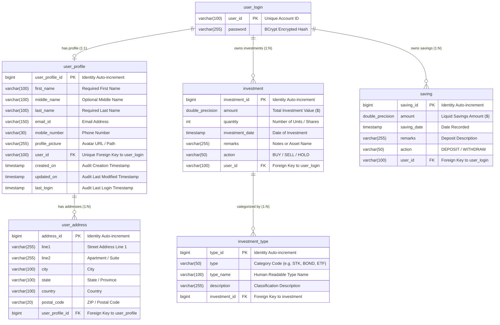
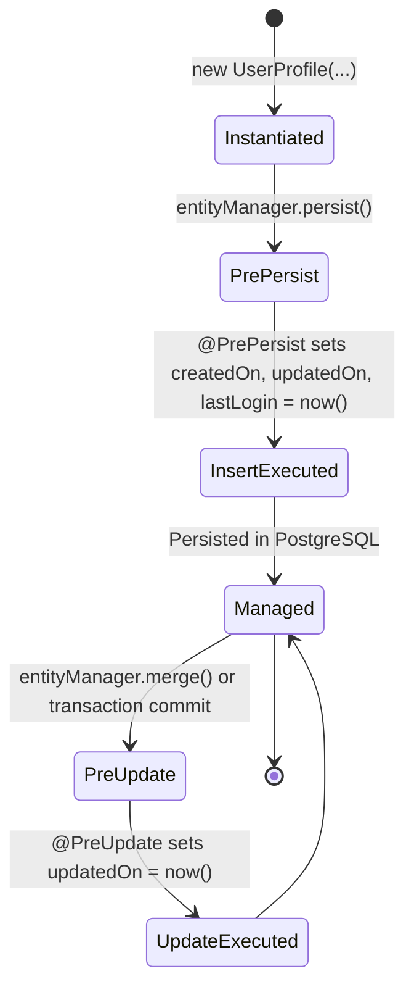

# Database Schema & Persistence Specification

This document provides a low-level, field-by-field specification of the relational schema, entity relationships, constraints, cascade rules, JPA auditing lifecycle, and database migration architecture for **Mio Wealth**.

---

## 1. Entity-Relationship (ER) Diagram



---

## 2. Table-by-Table Schema Specification

### 2.1 `user_login`
Represents core authentication credentials.
* **JPA Entity**: [`com.greenboard.investman.model.user.User`](file:///d:/F_Drive/github/mio-wealth/server/src/main/java/com/greenboard/investman/model/user/User.java)

| Column | SQL Type | Modifiers | Constraints | Description |
| :--- | :--- | :--- | :--- | :--- |
| `user_id` | `VARCHAR(100)` | `NOT NULL` | `PRIMARY KEY` | Unique account login identifier. |
| `password` | `VARCHAR(255)` | `NOT NULL` | — | BCrypt-hashed password string. |

---

### 2.2 `user_profile`
Stores personal and biographical details. Inherits audit fields from [`UserAudit`](file:///d:/F_Drive/github/mio-wealth/server/src/main/java/com/greenboard/investman/model/common/UserAudit.java).
* **JPA Entity**: [`com.greenboard.investman.model.user.UserProfile`](file:///d:/F_Drive/github/mio-wealth/server/src/main/java/com/greenboard/investman/model/user/UserProfile.java)

| Column | SQL Type | Modifiers | Constraints | Description |
| :--- | :--- | :--- | :--- | :--- |
| `user_profile_id` | `BIGINT` | `NOT NULL` | `PRIMARY KEY`, `IDENTITY` | Surrogate auto-generated ID. |
| `first_name` | `VARCHAR(100)` | `NOT NULL` | — | First name of the account holder. |
| `middle_name` | `VARCHAR(100)` | `NULL` | — | Optional middle name. |
| `last_name` | `VARCHAR(100)` | `NOT NULL` | — | Last name / family name. |
| `email_id` | `VARCHAR(150)` | `NOT NULL` | — | Primary contact email address. |
| `mobile_number` | `VARCHAR(30)` | `NULL` | — | Contact telephone number. |
| `profile_picture`| `VARCHAR(255)` | `NULL` | — | URL or file path for profile picture. |
| `user_id` | `VARCHAR(100)` | `NULL` | `UNIQUE`, `FK (user_login)` | Foreign key linking 1:1 to `user_login`. |
| `created_on` | `TIMESTAMP` | `NOT NULL` | `DEFAULT CURRENT_TIMESTAMP` | Account creation timestamp. |
| `updated_on` | `TIMESTAMP` | `NOT NULL` | `DEFAULT CURRENT_TIMESTAMP` | Last profile update timestamp. |
| `last_login` | `TIMESTAMP` | `NOT NULL` | `DEFAULT CURRENT_TIMESTAMP` | Most recent authentication timestamp. |

* **Foreign Key**: `CONSTRAINT fk_user_profile_user FOREIGN KEY (user_id) REFERENCES user_login(user_id) ON DELETE CASCADE`

---

### 2.3 `user_address`
Stores physical mailing, residential, or billing addresses.
* **JPA Entity**: [`com.greenboard.investman.model.user.Address`](file:///d:/F_Drive/github/mio-wealth/server/src/main/java/com/greenboard/investman/model/user/Address.java)

| Column | SQL Type | Modifiers | Constraints | Description |
| :--- | :--- | :--- | :--- | :--- |
| `address_id` | `BIGINT` | `NOT NULL` | `PRIMARY KEY`, `IDENTITY` | Auto-increment primary key. |
| `line1` | `VARCHAR(255)` | `NULL` | — | Primary street address line. |
| `line2` | `VARCHAR(255)` | `NULL` | — | Suite, unit, or building number. |
| `city` | `VARCHAR(100)` | `NULL` | — | Municipality / city. |
| `state` | `VARCHAR(100)` | `NULL` | — | State or province code. |
| `country` | `VARCHAR(100)` | `NULL` | — | Country name or ISO code. |
| `postal_code` | `VARCHAR(20)` | `NULL` | — | Postal or ZIP routing code. |
| `user_profile_id`| `BIGINT` | `NULL` | `FK (user_profile)` | Owning user profile ID. |

* **Foreign Key**: `CONSTRAINT fk_user_address_profile FOREIGN KEY (user_profile_id) REFERENCES user_profile(user_profile_id) ON DELETE CASCADE`

---

### 2.4 `investment`
Tracks portfolio assets, holdings, equities, bonds, and real estate allocations.
* **JPA Entity**: [`com.greenboard.investman.model.investment.Investment`](file:///d:/F_Drive/github/mio-wealth/server/src/main/java/com/greenboard/investman/model/investment/Investment.java)

| Column | SQL Type | Modifiers | Constraints | Description |
| :--- | :--- | :--- | :--- | :--- |
| `investment_id` | `BIGINT` | `NOT NULL` | `PRIMARY KEY`, `IDENTITY` | Auto-increment primary key. |
| `amount` | `DOUBLE PRECISION`| `NULL` | `DEFAULT 0.0` | Total monetary valuation or cost basis. |
| `quantity` | `INT` | `NULL` | `DEFAULT 0` | Share count, token quantity, or units held. |
| `investment_date`| `TIMESTAMP` | `NULL` | — | Timestamp when transaction was recorded. |
| `remarks` | `VARCHAR(255)` | `NULL` | — | Name or description of holding (e.g., AAPL). |
| `action` | `VARCHAR(50)` | `NULL` | — | Portfolio action (`BUY`, `SELL`, `HOLD`). |
| `user_id` | `VARCHAR(100)` | `NULL` | `FK (user_login)` | Owning investor user ID. |

* **Foreign Key**: `CONSTRAINT fk_investment_user FOREIGN KEY (user_id) REFERENCES user_login(user_id) ON DELETE CASCADE`

---

### 2.5 `investment_type`
Categorizes investment records into asset classes (Equities, Fixed Income, Real Estate, Crypto).
* **JPA Entity**: [`com.greenboard.investman.model.investment.InvestmentType`](file:///d:/F_Drive/github/mio-wealth/server/src/main/java/com/greenboard/investman/model/investment/InvestmentType.java)

| Column | SQL Type | Modifiers | Constraints | Description |
| :--- | :--- | :--- | :--- | :--- |
| `type_id` | `BIGINT` | `NOT NULL` | `PRIMARY KEY`, `IDENTITY` | Auto-increment primary key. |
| `type` | `VARCHAR(50)` | `NULL` | — | Asset class code (e.g. `STK`, `REIT`). |
| `type_name` | `VARCHAR(100)` | `NULL` | — | Category display label. |
| `description` | `VARCHAR(255)` | `NULL` | — | Long-form asset class explanation. |
| `investment_id` | `BIGINT` | `NULL` | `FK (investment)` | Associated parent investment record. |

* **Foreign Key**: `CONSTRAINT fk_type_investment FOREIGN KEY (investment_id) REFERENCES investment(investment_id) ON DELETE CASCADE`

---

### 2.6 `saving`
Tracks liquid cash reserves, emergency funds, and high-yield savings accounts.
* **JPA Entity**: [`com.greenboard.investman.model.saving.Saving`](file:///d:/F_Drive/github/mio-wealth/server/src/main/java/com/greenboard/investman/model/saving/Saving.java)

| Column | SQL Type | Modifiers | Constraints | Description |
| :--- | :--- | :--- | :--- | :--- |
| `saving_id` | `BIGINT` | `NOT NULL` | `PRIMARY KEY`, `IDENTITY` | Auto-increment primary key. |
| `amount` | `DOUBLE PRECISION`| `NULL` | `DEFAULT 0.0` | Balance amount. |
| `saving_date` | `TIMESTAMP` | `NULL` | — | Date recorded. |
| `remarks` | `VARCHAR(255)` | `NULL` | — | Account or goal notes. |
| `action` | `VARCHAR(50)` | `NULL` | — | Flow direction (`DEPOSIT`, `WITHDRAW`). |
| `user_id` | `VARCHAR(100)` | `NULL` | `FK (user_login)` | Owning user account. |

* **Foreign Key**: `CONSTRAINT fk_saving_user FOREIGN KEY (user_id) REFERENCES user_login(user_id) ON DELETE CASCADE`

---

## 3. Auditing & JPA Entity Lifecycle

All temporal audit columns are managed through the mapped superclass [`UserAudit.java`](file:///d:/F_Drive/github/mio-wealth/server/src/main/java/com/greenboard/investman/model/common/UserAudit.java).



### Defensive Persistence Architecture:
1. **Spring Data JPA Auditing**: Enabled via `@EnableJpaAuditing` on `InvestmentManagerApplication.java`.
2. **Explicit Fallback Hooks**: Declared `@PrePersist` and `@PreUpdate` methods inside `UserAudit` ensure that even if Spring Data's reflection listener is bypassed, timestamps are guaranteed non-null before the SQL `INSERT` or `UPDATE` executes.

---

## 4. Flyway Migrations & DDL Strategy

* **Migration Script**: [`V1__init_schema.sql`](file:///d:/F_Drive/github/mio-wealth/server/src/main/resources/db/migration/V1__init_schema.sql)
* **Configuration** (`application.yml`):
  ```yaml
  spring:
    jpa:
      hibernate:
        ddl-auto: ${SPRING_JPA_HIBERNATE_DDL_AUTO:update}
    flyway:
      enabled: ${SPRING_FLYWAY_ENABLED:false}
      baseline-on-migrate: true
      locations: classpath:db/migration
  ```
* **Production Recommendation**: When deploying to production environments, set `SPRING_FLYWAY_ENABLED=true` and `SPRING_JPA_HIBERNATE_DDL_AUTO=validate` to enforce deterministic, versioned database migrations.
