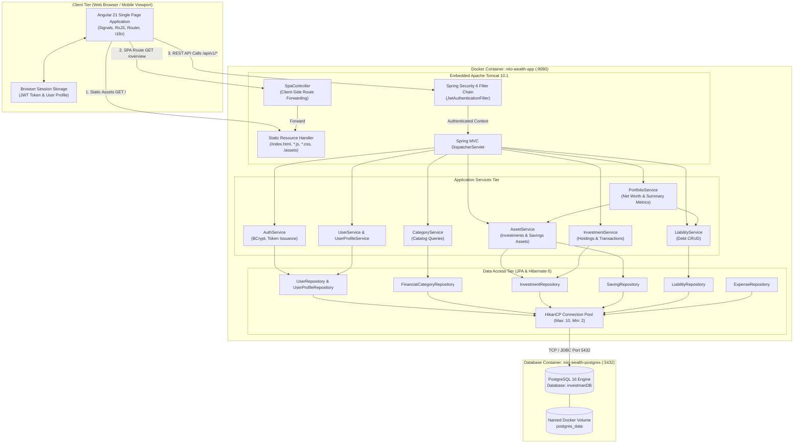
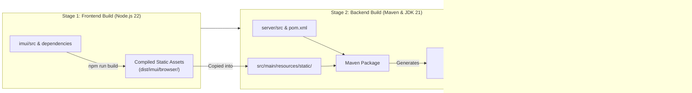
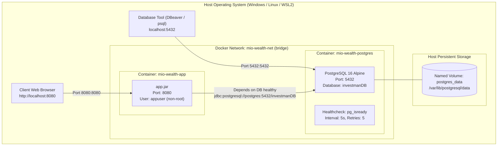
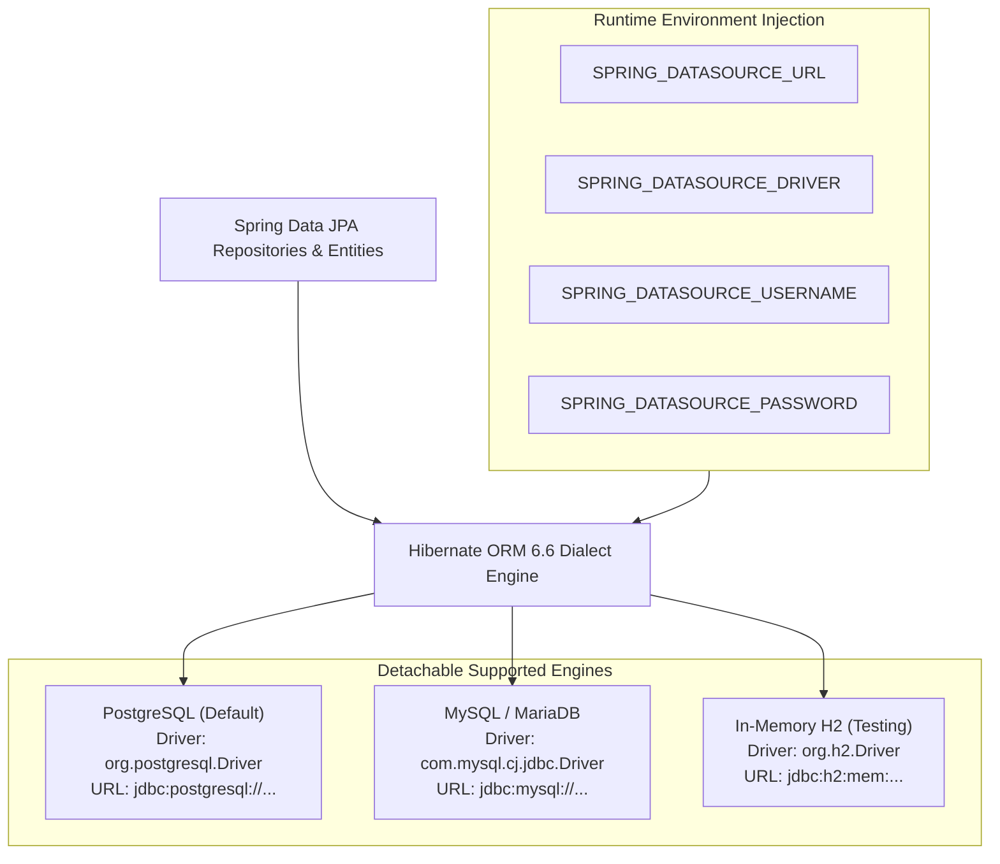
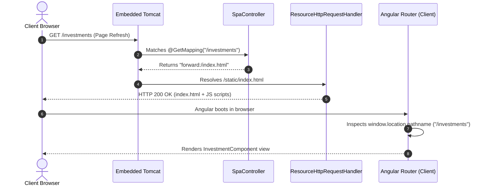

# High-Level Architecture & System Design

This document describes the high-level system architecture, deployment topology, monorepo unified packaging, container virtualization, and database portability strategy for **Mio Wealth**.

---

## 1. System Architecture Overview

Mio Wealth is built according to the **12-Factor App** methodology and cloud-native architectural patterns. The system serves as a unified financial hub where a client-side Single Page Application (SPA) communicates statelessly with a Java REST backend over HTTPS/HTTP.



---

## 2. Monorepo Unified Fat JAR Packaging

The application utilizes a **Unified Deployment Artifact** approach. Both the Angular frontend (`imui`) and the Spring Boot backend (`server`) reside in the same monorepo and compile into a single executable JAR (`investman-0.0.1-SNAPSHOT.jar`).

### Benefits of the Unified Model:
1. **Zero CORS Overheads**: The Angular SPA and REST API share the identical origin (`http://host:8080`). Browsers execute direct requests without triggering cross-origin preflight `OPTIONS` traffic.
2. **Atomic Versioning**: UI and API are deployed simultaneously. There is zero risk of frontend-backend version mismatch or breaking contract drift.
3. **Operational Simplicity**: Deployment targets (Docker, AWS ECS, GCP Cloud Run, Kubernetes) manage a single container image.



---

## 3. Docker Infrastructure & Networking

The system is defined as an infrastructure-as-code deployment via `docker-compose.yml` operating on an isolated bridge network `mio-wealth-net`.



### Key Infrastructure Specifications:
* **Container Hardening**: The application runs under a dedicated, unprivileged POSIX user (`appuser`, group `appgroup`).
* **Service Dependency Healthcheck**: The application container (`mio-wealth-app`) uses `depends_on: postgres: condition: service_healthy` ensuring Spring Boot only attempts database initialization after PostgreSQL is verified ready via `pg_isready`.
* **Data Durability**: Relational state is stored in the external volume `postgres_data`, surviving container teardown, rebuilds, and upgrades.

---

## 4. Detachable Multi-Database Architecture

A foundational architectural requirement of Mio Wealth is **database detachability**: the ability to swap the backing database engine (PostgreSQL, MySQL, MariaDB, or H2) without modifying source code.



### Portability Guarantees in Code:
1. **Vendor-Agnostic ID Generation**: All JPA entities declare `@GeneratedValue(strategy = GenerationType.IDENTITY)`, adhering to standard SQL identity columns supported natively across PostgreSQL, MySQL, SQL Server, and SQLite.
2. **ANSI SQL Schema Migrations**: The Flyway migration (`V1__init_schema.sql`) uses standard ANSI data types (`VARCHAR`, `BIGINT`, `TIMESTAMP`, `DOUBLE PRECISION`, `INT`) and standard constraint syntax.
3. **Driver-Agnostic External Configuration**: Datasource driver classes, JDBC URLs, and credentials in `application.yml` are 100% externalized via standard Spring environment variables with zero hardcoding.

---

## 5. Single Page Application (SPA) Forwarding Engine

Because Angular utilizes HTML5 PushState routing (clean URLs like `/overview`, `/investments`, `/settings` without hash fragments), direct navigation or browser page reloads must not result in HTTP 404 Not Found from the embedded server.



### Controller Implementation ([`SpaController.java`](file:///d:/F_Drive/github/mio-wealth/server/src/main/java/com/greenboard/investman/controller/spa/SpaController.java)):
```java
@Controller
public class SpaController {
    @GetMapping(value = {
        "/", "/overview", "/investments", "/balance", 
        "/cash-flow", "/expenses", "/performance", 
        "/goals", "/settings", "/login", "/signup"
    })
    public String forwardToSpa() {
        return "forward:/index.html";
    }
}
```
All client-side route entries are intercepted and transparently dispatched to `/index.html` server-side, enabling full deep-linking and browser navigation resilience.
