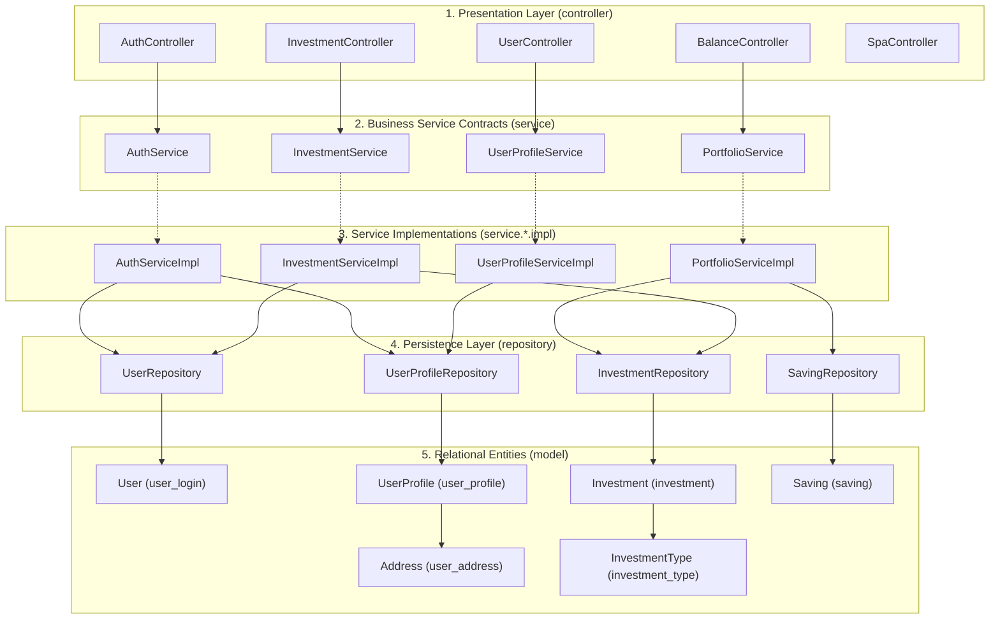
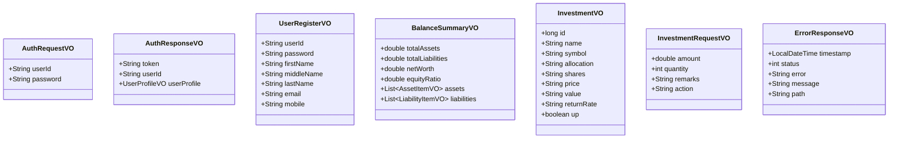
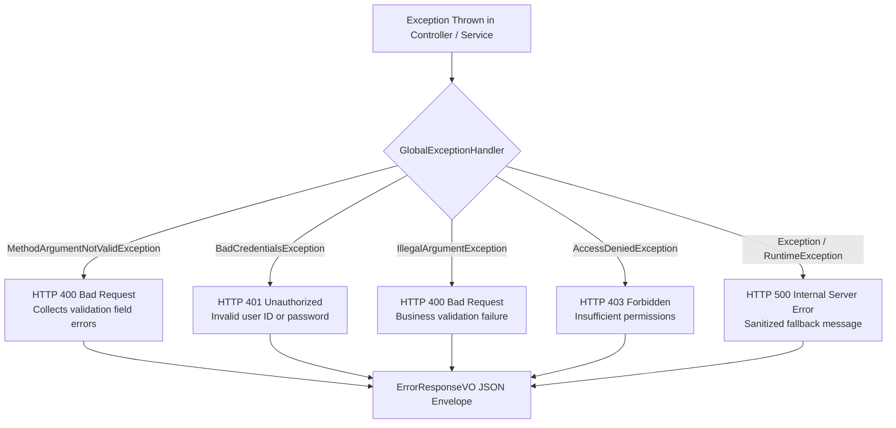

# Low-Level Design & Component Internals

This document provides a detailed code-level breakdown of the Spring Boot backend architecture, design patterns, package organization, class dependencies, and error handling mechanics.

---

## 1. Package Organization & Layered Architecture

The application strictly enforces a four-tier clean architecture pattern:
1. **Presentation / Web Layer (`controller`)**: Exposes REST endpoints, validates input DTOs, extracts security principals, and returns standard HTTP status envelopes.
2. **Business Service Layer (`service`)**: Contains domain logic behind clean Java interfaces, with concrete implementations separated into `service.*.impl`.
3. **Data Persistence Layer (`repository` & `model`)**: Spring Data JPA repositories interfacing with JPA entity models mapped to relational tables.
4. **Data Transfer Objects (`vo`)**: Strongly-typed request/response models preventing database entity leakage across the API boundary.



---

## 2. Dependency Inversion & Constructor Injection

To strictly adhere to SOLID principles and ensure testability with zero mock frameworks overhead, **field injection (`@Autowired`) is 100% prohibited**. Every component uses explicit constructor-based dependency injection.

### Example: [`AuthServiceImpl.java`](file:///d:/F_Drive/github/mio-wealth/server/src/main/java/com/greenboard/investman/service/auth/impl/AuthServiceImpl.java)
```java
@Service
public class AuthServiceImpl implements AuthService {

    private final UserRepository userRepository;
    private final UserProfileRepository userProfileRepository;
    private final PasswordEncoder passwordEncoder;
    private final JwtTokenProvider jwtTokenProvider;

    public AuthServiceImpl(UserRepository userRepository,
                           UserProfileRepository userProfileRepository,
                           PasswordEncoder passwordEncoder,
                           JwtTokenProvider jwtTokenProvider) {
        this.userRepository = userRepository;
        this.userProfileRepository = userProfileRepository;
        this.passwordEncoder = passwordEncoder;
        this.jwtTokenProvider = jwtTokenProvider;
    }
    // ...
}
```

---

## 3. Detailed Component Catalog

### 3.1 Controllers

| Controller | Base Path | Key Responsibilities |
| :--- | :--- | :--- |
| [`AuthController`](file:///d:/F_Drive/github/mio-wealth/server/src/main/java/com/greenboard/investman/controller/auth/AuthController.java) | `/api/v1/auth` | User registration (`/register`), credential authentication & JWT token generation (`/login`). |
| [`BalanceController`](file:///d:/F_Drive/github/mio-wealth/server/src/main/java/com/greenboard/investman/controller/balance/BalanceController.java) | `/api/v1/balance` | Aggregates liquid, investment, and real estate assets against liabilities, returning net worth & equity ratio. |
| [`InvestmentController`](file:///d:/F_Drive/github/mio-wealth/server/src/main/java/com/greenboard/investman/controller/investment/InvestmentController.java) | `/api/v1/investments` | Retrieves user portfolio holdings (`GET`) and persists new asset investments (`POST`). |
| [`UserController`](file:///d:/F_Drive/github/mio-wealth/server/src/main/java/com/greenboard/investman/controller/user/UserController.java) | `/api/v1/users` | Retrieves authenticated user profile (`GET /profile`) via verified JWT principal. |
| [`SpaController`](file:///d:/F_Drive/github/mio-wealth/server/src/main/java/com/greenboard/investman/controller/spa/SpaController.java) | Direct routes | Intercepts SPA route entries (`/overview`, `/investments`, `/login`, etc.) and forwards to `/index.html`. |

### 3.2 Services & Implementations

| Interface | Implementation | Operations & Business Rules |
| :--- | :--- | :--- |
| [`AuthService`](file:///d:/F_Drive/github/mio-wealth/server/src/main/java/com/greenboard/investman/service/auth/AuthService.java) | `AuthServiceImpl` | Validates passwords against BCrypt hashes, generates signed HMAC-SHA256 JWT tokens, and creates initial `User` + `UserProfile` records. |
| [`PortfolioService`](file:///d:/F_Drive/github/mio-wealth/server/src/main/java/com/greenboard/investman/service/balance/PortfolioService.java) | `PortfolioServiceImpl` | Computes aggregate net worth = $\sum \text{Assets} - \sum \text{Liabilities}$, and calculates equity ratio percentage: $\frac{\text{Net Worth}}{\text{Total Assets}} \times 100$. |
| [`InvestmentService`](file:///d:/F_Drive/github/mio-wealth/server/src/main/java/com/greenboard/investman/service/investment/InvestmentService.java) | `InvestmentServiceImpl` | Fetches active investments for a given user ID, provides fallback baseline holdings for new accounts, and saves new `Investment` entities. |
| [`UserProfileService`](file:///d:/F_Drive/github/mio-wealth/server/src/main/java/com/greenboard/investman/service/user/UserProfileService.java) | `UserProfileServiceImpl` | Retrieves detailed personal profile information by authenticated `userId`. |

### 3.3 Spring Data JPA Repositories

| Repository | Entity | Key Query Methods |
| :--- | :--- | :--- |
| [`UserRepository`](file:///d:/F_Drive/github/mio-wealth/server/src/main/java/com/greenboard/investman/repository/user/UserRepository.java) | `User` (String PK) | `existsById(String userId)`, `findById(String userId)` |
| [`UserProfileRepository`](file:///d:/F_Drive/github/mio-wealth/server/src/main/java/com/greenboard/investman/repository/user/UserProfileRepository.java) | `UserProfile` (Long PK) | `findByUser_UserId(String userId)` |
| [`InvestmentRepository`](file:///d:/F_Drive/github/mio-wealth/server/src/main/java/com/greenboard/investman/repository/investment/InvestmentRepository.java) | `Investment` (Long PK) | `findByUser_UserId(String userId)` |
| [`SavingRepository`](file:///d:/F_Drive/github/mio-wealth/server/src/main/java/com/greenboard/investman/repository/saving/SavingRepository.java) | `Saving` (Long PK) | `findByUser_UserId(String userId)` |

---

## 4. Value Objects (VO) & DTO Data Mapping

To prevent over-fetching, circular JSON references, and accidental exposure of sensitive entity columns (such as password hashes), all controller endpoints exchange dedicated Value Objects (VOs).



---

## 5. Global Exception Handling & Error Envelope

All uncaught runtime exceptions, validation errors, and authentication failures are intercepted by [`GlobalExceptionHandler`](file:///d:/F_Drive/github/mio-wealth/server/src/main/java/com/greenboard/investman/exception/GlobalExceptionHandler.java) (`@RestControllerAdvice`).



### Standard Error Response Format:
```json
{
  "timestamp": "2026-09-19T19:15:30",
  "status": 400,
  "error": "Bad Request",
  "message": "password is required, valid email is required",
  "path": "/api/v1/auth/register"
}
```
This standardized structure allows the client-side Angular [`errorInterceptor`](file:///d:/F_Drive/github/mio-wealth/imui/src/app/interceptors/error.interceptor.ts) to parse error messages reliably and display actionable feedback in toast notifications.
