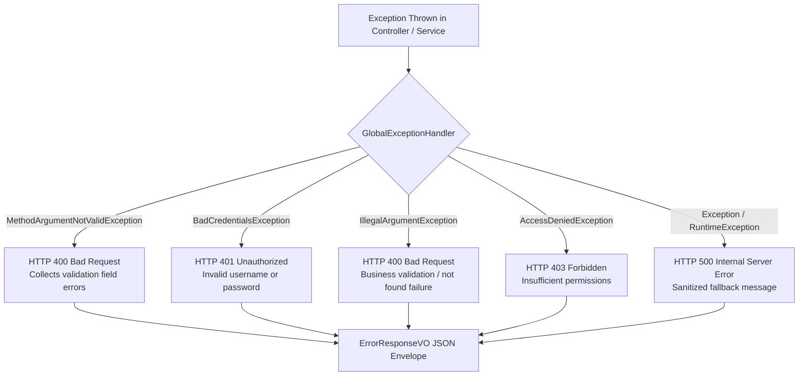

# Low-Level Design & Component Internals

This document provides a detailed code-level breakdown of the Spring Boot backend architecture, Schema-per-Tenant multi-tenancy routing, design patterns, package organization, class dependencies, and error handling mechanics.

---

## 1. Package Organization & Layered Architecture

The application strictly enforces a four-tier clean architecture pattern augmented with an enterprise multi-tenancy routing subsystem:

1. **Presentation / Web Layer (`controller`)**: Exposes REST endpoints, validates input DTOs, and returns standard HTTP status envelopes without leaking UI presentation formatting.
2. **Business Service Layer (`service`)**: Contains domain logic behind clean Java interfaces, with concrete implementations separated into `service.*.impl`. Operates purely on tenant-scoped data without manual `userId` passing.
3. **Multi-Tenancy Subsystem (`multitenancy`)**: Intercepts requests, resolves the active tenant schema from ThreadLocal context, dynamically switches PostgreSQL `search_path`, and provisions new tenant schemas via Flyway.
4. **Data Persistence Layer (`repository` & `model`)**: Spring Data JPA repositories interfacing with JPA entity models mapped to relational tables.
5. **Data Transfer Objects (`vo`)**: Strongly-typed request/response models preventing database entity leakage across the API boundary.

```mermaid
graph TD
    subgraph WebLayer["1. Presentation Layer (controller)"]
        AC["AuthController"]
        BC["BalanceController"]
        IC["InvestmentController"]
        CC["CategoryController"]
        UC["UserController"]
        SC["SpaController"]
    end

    subgraph MultiTenancyCore["2. Multi-Tenancy Core (multitenancy)"]
        TC["TenantContext<br/>(ThreadLocal tenant ID)"]
        TIR["TenantIdentifierResolver<br/>(Hibernate Tenant Resolver)"]
        MCP["SchemaMultiTenantConnectionProvider<br/>(search_path Router)"]
        TPS["TenantProvisioningService<br/>(Flyway Tenant Migration Runner)"]
    end

    subgraph ServiceContracts["3. Business Service Contracts (service)"]
        AS["AuthService"]
        PS["PortfolioService"]
        AtS["AssetService"]
        LS["LiabilityService"]
        IS["InvestmentService"]
        CS["CategoryService"]
        UPS["UserProfileService"]
    end

    subgraph ServiceImpls["4. Service Implementations (service.*.impl)"]
        ASI["AuthServiceImpl"]
        PSI["PortfolioServiceImpl"]
        AtSI["AssetServiceImpl"]
        LSI["LiabilityServiceImpl"]
        ISI["InvestmentServiceImpl"]
        CSI["CategoryServiceImpl"]
        UPSI["UserProfileServiceImpl"]
    end

    subgraph DataAccess["5. Persistence Layer (repository)"]
        UR["UserRepository (public.user_login)"]
        CR["FinancialCategoryRepository (public.financial_category)"]
        UPR["UserProfileRepository (tenant.user_profile)"]
        IR["InvestmentRepository (tenant.investment)"]
        SR["SavingRepository (tenant.saving)"]
        LR["LiabilityRepository (tenant.liability)"]
        ER["ExpenseRepository (tenant.expense)"]
    end

    AC --> AS
    BC --> PS
    BC --> AtS
    BC --> LS
    IC --> IS
    CC --> CS
    UC --> UPS

    AS -.-> ASI
    PS -.-> PSI
    AtS -.-> AtSI
    LS -.-> LSI
    IS -.-> ISI
    CS -.-> CSI
    UPS -.-> UPSI

    ASI --> UR
    ASI --> TPS
    ASI --> UPR
    PSI --> AtS
    PSI --> LS
    AtSI --> IR
    AtSI --> SR
    LSI --> LR
    LSI --> CR
    ISI --> IR
    ISI --> CR
    CSI --> CR
    UPSI --> UPR

    TC --> TIR
    TIR --> MCP
```



---

## 2. Multi-Tenancy Core Subsystem

The multi-tenancy subsystem manages schema isolation transparently at the database connection layer without contaminating business logic with user IDs.

### 2.1 [`TenantContext.java`](file:///d:/F_Drive/github/mio-wealth/server/src/main/java/com/greenboard/investman/multitenancy/TenantContext.java)
ThreadLocal storage holding the active tenant schema for the duration of the HTTP request thread.
```java
public final class TenantContext {
    public static final String DEFAULT_TENANT = "public";
    private static final ThreadLocal<String> CURRENT_TENANT = new ThreadLocal<>();

    public static void setTenantId(String tenantId) { CURRENT_TENANT.set(tenantId); }
    public static String getTenantId() {
        String tenant = CURRENT_TENANT.get();
        return tenant != null && !tenant.isBlank() ? tenant : DEFAULT_TENANT;
    }
    public static void clear() { CURRENT_TENANT.remove(); }
}
```

### 2.2 [`TenantIdentifierResolver.java`](file:///d:/F_Drive/github/mio-wealth/server/src/main/java/com/greenboard/investman/multitenancy/TenantIdentifierResolver.java)
Implements `CurrentTenantIdentifierResolver<String>` and `HibernatePropertiesCustomizer`. Feeds the current tenant schema name directly to Hibernate 6's multi-tenancy contract.

### 2.3 [`SchemaMultiTenantConnectionProvider.java`](file:///d:/F_Drive/github/mio-wealth/server/src/main/java/com/greenboard/investman/multitenancy/SchemaMultiTenantConnectionProvider.java)
Extends `AbstractDataSourceBasedMultiTenantConnectionProviderImpl<String>`. On connection checkout, sets the PostgreSQL search path:
```sql
SET search_path TO "<tenant_schema>", public;
```
On release, safely restores the connection back to `public;`.

### 2.4 [`TenantProvisioningService.java`](file:///d:/F_Drive/github/mio-wealth/server/src/main/java/com/greenboard/investman/multitenancy/TenantProvisioningService.java)
Handles dynamic tenant schema lifecycle and profile persistence:
* **`provisionTenant(String schemaName)`**: Executes `CREATE SCHEMA IF NOT EXISTS "<schema>"` and programmatic Flyway migrations from `classpath:db/migration/tenants` to establish isolated tenant tables.
* **`initTenantProfile(schemaName, firstName, ...)`**: Seeds the default user profile directly inside the newly provisioned tenant schema via dedicated JDBC connection, avoiding Hibernate cross-tenant session binding issues during registration.
* **`getTenantProfile(schemaName)`**: Reads the tenant profile for authentication responses without requiring premature `TenantContext` switching.

---

## 3. Dependency Inversion & Clean Code Principles

To strictly adhere to SOLID and Clean Code principles:
1. **Zero Field Injection**: Field injection (`@Autowired`) is strictly prohibited. Every component uses explicit constructor injection.
2. **Compactness Over Verbosity**:
   - Complex conditional ladders (e.g. error code handlers, domain categorization) use constant dictionary maps ($O(1)$ lookup) rather than repetitive `switch-case` or `if-else` cascades.
3. **Zero UI Formatting in Backend**:
   - All monetary values are pure `double` numbers.
   - All entity identifiers are pure UUID strings.
   - Formatting (currency signs, percentages, icons, colors) is exclusively executed by the client UI.

### Example: [`InvestmentServiceImpl.java`](file:///d:/F_Drive/github/mio-wealth/server/src/main/java/com/greenboard/investman/service/investment/impl/InvestmentServiceImpl.java)
```java
@Service
public class InvestmentServiceImpl implements InvestmentService {

    private static final Logger log = LoggerFactory.getLogger(InvestmentServiceImpl.class);

    private final InvestmentRepository investmentRepository;
    private final FinancialCategoryRepository categoryRepository;

    public InvestmentServiceImpl(InvestmentRepository investmentRepository,
                                 FinancialCategoryRepository categoryRepository) {
        this.investmentRepository = investmentRepository;
        this.categoryRepository = categoryRepository;
    }

    @Override
    @Transactional(readOnly = true)
    public List<InvestmentVO> getInvestments() {
        return investmentRepository.findAll().stream()
                .map(this::toVO)
                .collect(Collectors.toList());
    }

    @Override
    @Transactional(readOnly = true)
    public InvestmentVO getInvestmentById(String id) {
        return investmentRepository.findById(id)
                .map(this::toVO)
                .orElseThrow(() -> new IllegalArgumentException("Investment not found: " + id));
    }

    @Override
    @Transactional
    public InvestmentVO createInvestment(InvestmentRequestVO request) {
        FinancialCategory category = categoryRepository.findById(request.getCategoryCode())
                .orElseThrow(() -> new IllegalArgumentException("Invalid category code: " + request.getCategoryCode()));

        double unitPrice = request.getUnitPrice() != null && request.getUnitPrice() > 0
                ? request.getUnitPrice()
                : (request.getQuantity() > 0 ? request.getAmount() / request.getQuantity() : request.getAmount());

        Investment investment = new Investment();
        investment.setSymbol(request.getSymbol().trim().toUpperCase());
        investment.setAssetName(request.getAssetName().trim());
        investment.setCategory(category);
        investment.setAmount(request.getAmount());
        investment.setQuantity(request.getQuantity());
        investment.setUnitPrice(unitPrice);
        investment.setRemarks(request.getRemarks());
        investment.setTags(request.getTags());
        investment.setAction(request.getAction() != null && !request.getAction().isBlank() ? request.getAction() : "BUY");
        investment.setInvestmentDate(LocalDateTime.now());

        Investment saved = investmentRepository.save(investment);
        return toVO(saved);
    }
    // ...
}
```

---

## 4. Detailed Component Catalog

### 4.1 Controllers

| Controller | Base Path | Key Responsibilities |
| :--- | :--- | :--- |
| [`AuthController`](file:///d:/F_Drive/github/mio-wealth/server/src/main/java/com/greenboard/investman/controller/auth/AuthController.java) | `/api/v1/auth` | User registration (`/register`), credential authentication, tenant lookup, & JWT issuance (`/login`). |
| [`BalanceController`](file:///d:/F_Drive/github/mio-wealth/server/src/main/java/com/greenboard/investman/controller/balance/BalanceController.java) | `/api/v1/balance` | Aggregates portfolio assets against liabilities for net worth & equity metrics without manual user ID passing. |
| [`InvestmentController`](file:///d:/F_Drive/github/mio-wealth/server/src/main/java/com/greenboard/investman/controller/investment/InvestmentController.java) | `/api/v1/investments` | Full CRUD operations (`GET`, `POST`, `PUT`, `DELETE`) for tenant investment assets. |
| [`CategoryController`](file:///d:/F_Drive/github/mio-wealth/server/src/main/java/com/greenboard/investman/controller/category/CategoryController.java) | `/api/v1/categories` | Retrieves global canonical category catalogs partitioned by domain. |
| [`UserController`](file:///d:/F_Drive/github/mio-wealth/server/src/main/java/com/greenboard/investman/controller/user/UserController.java) | `/api/v1/users` | Retrieves the authenticated user's profile from their isolated tenant schema. |
| [`SpaController`](file:///d:/F_Drive/github/mio-wealth/server/src/main/java/com/greenboard/investman/controller/spa/SpaController.java) | Direct routes | Intercepts SPA route entries (`/overview`, `/investments`, `/login`, etc.) and forwards to `/index.html`. |

### 4.2 Services & Implementations

| Interface | Implementation | Operations & Business Rules |
| :--- | :--- | :--- |
| [`AuthService`](file:///d:/F_Drive/github/mio-wealth/server/src/main/java/com/greenboard/investman/service/auth/AuthService.java) | `AuthServiceImpl` | Registers master login, provisions private tenant schema, runs Flyway migrations, and mints JWTs with tenant claims. |
| [`PortfolioService`](file:///d:/F_Drive/github/mio-wealth/server/src/main/java/com/greenboard/investman/service/balance/PortfolioService.java) | `PortfolioServiceImpl` | Computes aggregate net worth = $\sum \text{Assets} - \sum \text{Liabilities}$, and calculates equity ratio percentage. |
| [`AssetService`](file:///d:/F_Drive/github/mio-wealth/server/src/main/java/com/greenboard/investman/service/balance/AssetService.java) | `AssetServiceImpl` | Aggregates investment and saving assets from the tenant schema. |
| [`LiabilityService`](file:///d:/F_Drive/github/mio-wealth/server/src/main/java/com/greenboard/investman/service/balance/LiabilityService.java) | `LiabilityServiceImpl` | Manages tenant debt obligations and loan records. |
| [`InvestmentService`](file:///d:/F_Drive/github/mio-wealth/server/src/main/java/com/greenboard/investman/service/investment/InvestmentService.java) | `InvestmentServiceImpl` | Full CRUD operations for portfolio holdings in the tenant schema. |
| [`UserProfileService`](file:///d:/F_Drive/github/mio-wealth/server/src/main/java/com/greenboard/investman/service/user/UserProfileService.java) | `UserProfileServiceImpl` | Retrieves personal profile information from the active tenant schema. |

### 4.3 Spring Data JPA Repositories

| Repository | Entity | Key Query Methods |
| :--- | :--- | :--- |
| [`UserRepository`](file:///d:/F_Drive/github/mio-wealth/server/src/main/java/com/greenboard/investman/repository/user/UserRepository.java) | `User` (Shared) | `findByUsername(String username)`, `existsByUsername(String username)` |
| [`FinancialCategoryRepository`](file:///d:/F_Drive/github/mio-wealth/server/src/main/java/com/greenboard/investman/repository/category/FinancialCategoryRepository.java) | `FinancialCategory` (Shared) | `findByDomain(FinancialDomain domain)` |
| [`UserProfileRepository`](file:///d:/F_Drive/github/mio-wealth/server/src/main/java/com/greenboard/investman/repository/user/UserProfileRepository.java) | `UserProfile` (Tenant) | `findTopByOrderByIdAsc()` |
| [`InvestmentRepository`](file:///d:/F_Drive/github/mio-wealth/server/src/main/java/com/greenboard/investman/repository/investment/InvestmentRepository.java) | `Investment` (Tenant) | `findAll()`, `findById(String id)`, `save(Investment inv)`, `deleteById(String id)` |
| [`SavingRepository`](file:///d:/F_Drive/github/mio-wealth/server/src/main/java/com/greenboard/investman/repository/saving/SavingRepository.java) | `Saving` (Tenant) | `findAll()`, `findById(String id)` |
| [`LiabilityRepository`](file:///d:/F_Drive/github/mio-wealth/server/src/main/java/com/greenboard/investman/repository/liability/LiabilityRepository.java) | `Liability` (Tenant) | `findAll()`, `save(Liability l)`, `deleteById(String id)` |

---

## 5. Global Exception Handling & Error Envelope

All uncaught runtime exceptions, validation errors, and authentication failures are intercepted by [`GlobalExceptionHandler`](file:///d:/F_Drive/github/mio-wealth/server/src/main/java/com/greenboard/investman/exception/GlobalExceptionHandler.java) (`@RestControllerAdvice`).



### Standard Error Response Format:
```json
{
  "timestamp": "2026-09-20T20:00:00",
  "status": 400,
  "error": "Bad Request",
  "message": "symbol is required, amount must be positive",
  "path": "/api/v1/investments"
}
```
The client-side Angular [`errorInterceptor`](file:///d:/F_Drive/github/mio-wealth/imui/src/app/interceptors/error.interceptor.ts) uses a compact $O(1)$ dictionary lookup to transform error responses into actionable user toast notifications.
