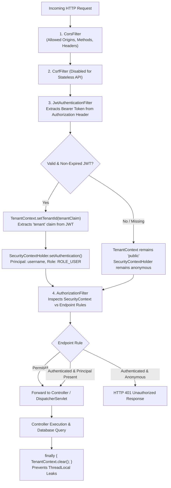
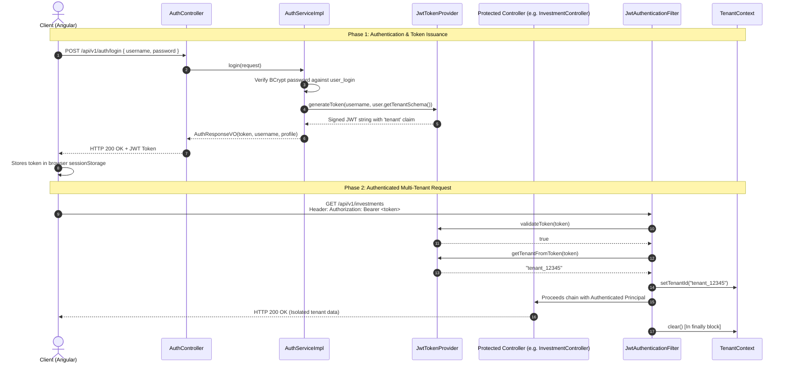
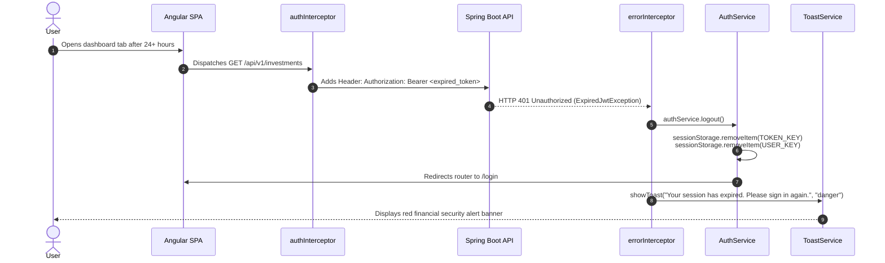

# Security, Authentication & Multi-Tenant Session Architecture

This document provides a comprehensive specification of the security architecture implemented in **Mio Wealth**, covering Spring Security 6, JWT token mechanics with embedded tenant claims, password hashing, stateless sessions, and frontend session recovery.

---

## 1. Spring Security 6 Stateless Filter Chain with Multi-Tenancy

Mio Wealth uses Spring Security 6 configured with **stateless session creation** (`SessionCreationPolicy.STATELESS`). The server does not maintain server-side HTTP sessions (`HttpSession`) in memory; all authentication state and tenant routing coordinates are carried within signed JSON Web Tokens (JWT).

---

## 2. JWT (JSON Web Token) Lifecycle & Specification

* **Implementation**: [`JwtTokenProvider.java`](file:///d:/F_Drive/github/mio-wealth/server/src/main/java/com/greenboard/investman/security/JwtTokenProvider.java)
* **Cryptographic Algorithm**: **HMAC-SHA256** using an externalized 256-bit secret key.
* **Token Structure**:
  * **Header**: `{"alg": "HS256", "typ": "JWT"}`
  * **Payload Claims**:
    * `sub` (Subject): The unique `username`
    * `tenant`: The assigned PostgreSQL schema name (e.g., `tenant_a1b2c3d4...`)
    * `iat` (Issued At): Timestamp of issuance
    * `exp` (Expiration): Issued timestamp + expiration window (Default: 24 hours / `86,400,000 ms`)
  * **Signature**: `HMACSHA256(base64UrlEncode(header) + "." + base64UrlEncode(payload), secret)`

---

## 3. Endpoint Access Control Matrix

Declared inside [`SecurityConfiguration.java`](file:///d:/F_Drive/github/mio-wealth/server/src/main/java/com/greenboard/investman/SecurityConfiguration.java):

| Route / URI Pattern | HTTP Methods | Access Level | Description |
| :--- | :--- | :--- | :--- |
| `/api/v1/auth/**` | `POST` | `permitAll()` | Public self-registration (`/register`) and sign in (`/login`). |
| `/swagger-ui/**`, `/v3/api-docs/**` | `GET` | `permitAll()` | Interactive OpenAPI 3 / Swagger documentation discovery. |
| `/`, `/index.html`, `/favicon.ico` | `GET` | `permitAll()` | Static frontend bootstrapping assets. |
| `/*.js`, `/*.css`, `/assets/**`, `/static/**` | `GET` | `permitAll()` | Angular compiled JavaScript, styles, fonts, and SVG icons. |
| `/overview`, `/investments`, `/balance`, `/cash-flow`, `/expenses`, `/performance`, `/goals`, `/settings`, `/login`, `/signup` | `GET` | `permitAll()` | Client-side SPA routes forwarded server-side to `index.html`. |
| `/api/v1/categories/**` | `GET` | `authenticated()` | Database-backed canonical category catalog. |
| `/api/v1/users/**` | `GET` | `authenticated()` | Protected tenant user profile (`/profile`). |
| `/api/v1/investments/**` | `GET`, `POST`, `PUT`, `DELETE` | `authenticated()` | Protected tenant portfolio holdings full CRUD. |
| `/api/v1/balance/**` | `GET`, `POST`, `DELETE` | `authenticated()` | Protected tenant portfolio summary, assets, liabilities CRUD. |
| Any other request | Any | `authenticated()` | Zero-trust default: all unlisted routes require authentication. |

---

## 4. Password Encryption Architecture

Passwords stored in `public.user_login.password` are protected using **BCrypt** with an adaptive work factor (cost 10).
* During registration (`/api/v1/auth/register`), raw passwords are encrypted with `passwordEncoder.encode(request.getPassword())` before persistence in `public.user_login`.
* Authentication employs constant-time hash verification via `passwordEncoder.matches(raw, hash)`.

---

## 5. Cross-Origin Resource Sharing (CORS) & CSRF Policy

### CORS Configuration:
Externalized via the `CORS_ALLOWED_ORIGINS` environment variable (default: `http://localhost:8080,http://localhost:4200`):
* **Allowed Methods**: `GET`, `POST`, `PUT`, `DELETE`, `OPTIONS`, `PATCH`
* **Allowed Headers**: `*` (including `Authorization`, `Content-Type`)
* **Credentials Allowed**: `true`
* **Preflight Max Age**: `3600` seconds (1 hour browser cache for preflight checks)

### CSRF Strategy:
Cross-Site Request Forgery (CSRF) protection is **explicitly disabled** (`csrf(AbstractHttpConfigurer::disable)`).
* **Rationale**: CSRF attacks rely on browser ambient credentials (automatic cookie submission). Because Mio Wealth uses stateless Bearer tokens stored in client `sessionStorage` and sent via the `Authorization` header, the browser does not transmit authentication state implicitly, making classic CSRF vectors inapplicable.

---

## 6. Client-Side Session Recovery & Expiration Interception

When a JWT token reaches its expiration threshold (24 hours), the client smoothly intercepts the failure and sanitizes its local storage.

* **Storage Isolation**: Tokens are stored in `sessionStorage` rather than `localStorage`, preventing tokens from persisting indefinitely or leaking across disparate browser windows.
