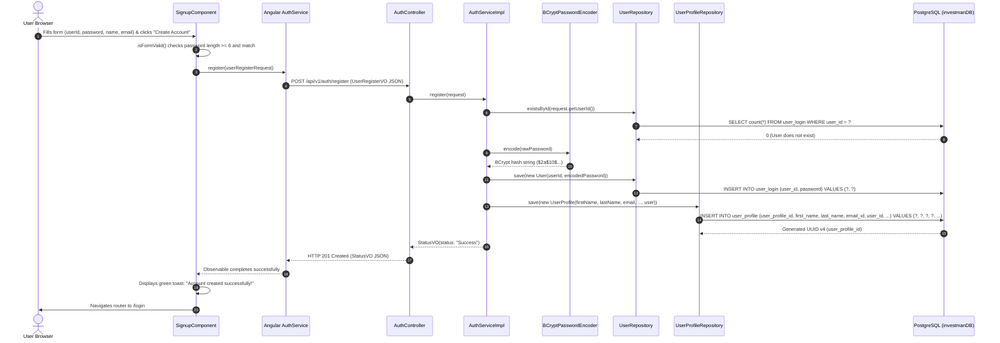
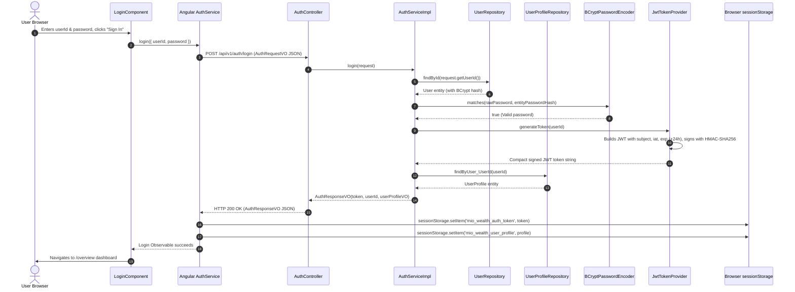
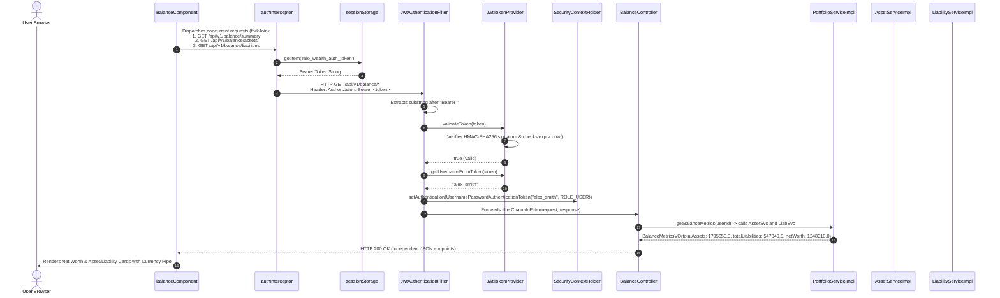
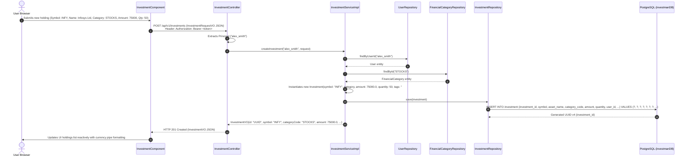
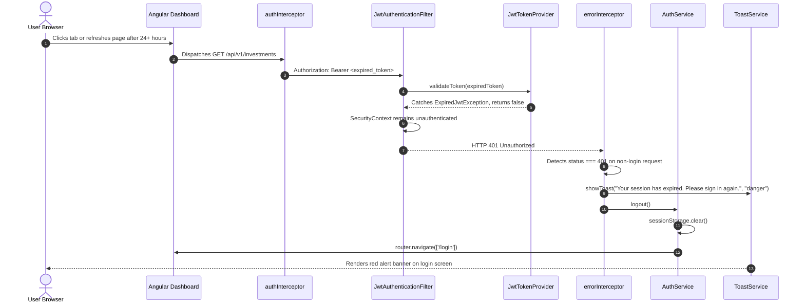

# End-to-End Sequence & Workflow Diagrams

This document illustrates the step-by-step runtime flows across the presentation, security, business service, and database tiers using detailed Mermaid sequence diagrams.

---

## 1. User Self-Registration Workflow

Illustrates the end-to-end flow when a user creates an account from [`/signup`](file:///d:/F_Drive/github/mio-wealth/imui/src/app/components/signup/signup.component.ts).

---

## 2. Authentication & JWT Token Issuance

Illustrates the credential validation, BCrypt comparison, and HMAC-SHA256 signature generation.

---

## 3. Authenticated Financial Request Execution

Demonstrates how [`authInterceptor`](file:///d:/F_Drive/github/mio-wealth/imui/src/app/interceptors/auth.interceptor.ts) and [`JwtAuthenticationFilter`](file:///d:/F_Drive/github/mio-wealth/server/src/main/java/com/greenboard/investman/security/JwtAuthenticationFilter.java) secure requests.

---

## 4. Investment Creation & Persistence

Shows how financial asset transactions are recorded with category classification and UUID generation.

---

## 5. Token Expiry & Automatic Session Purge

Shows the fault-tolerant session termination when a 24-hour token expires.

