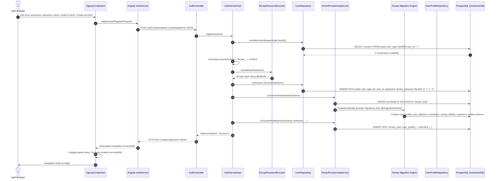
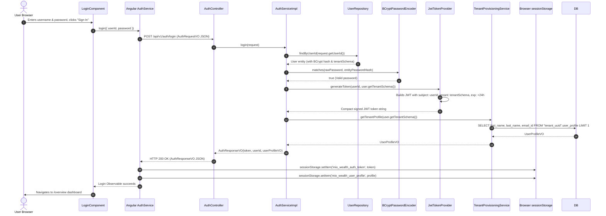
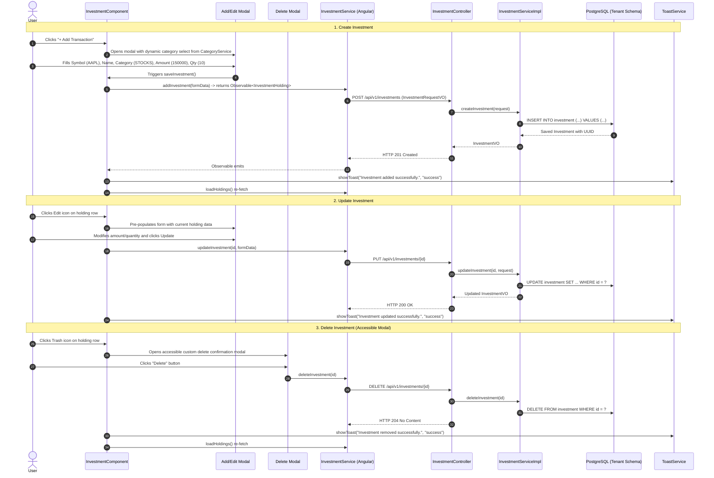
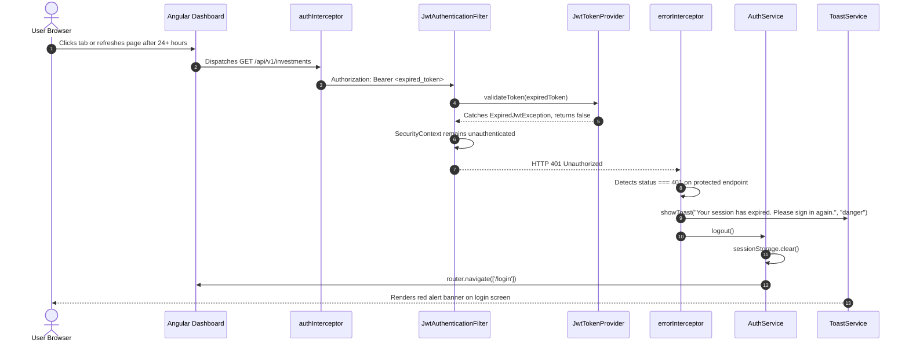

# End-to-End Sequence & Workflow Diagrams

This document illustrates the step-by-step runtime flows across presentation, security, multi-tenancy routing, business service, and database tiers using Mermaid sequence diagrams.

---

## 1. User Self-Registration & Tenant Provisioning Workflow

Illustrates the flow when a user creates an account from [`/signup`](file:///d:/F_Drive/github/mio-wealth/imui/src/app/components/signup/signup.component.ts), including dynamic schema provisioning and Flyway migration.



---

## 2. Authentication & Multi-Tenant Token Issuance

Illustrates credential validation against `public.user_login`, tenant schema extraction, and JWT issuance with embedded `tenant` claim.



---

## 3. Authenticated Request with Dynamic Schema Routing

Demonstrates how [`JwtAuthenticationFilter`](file:///d:/F_Drive/github/mio-wealth/server/src/main/java/com/greenboard/investman/security/JwtAuthenticationFilter.java) populates [`TenantContext`](file:///d:/F_Drive/github/mio-wealth/server/src/main/java/com/greenboard/investman/multitenancy/TenantContext.java) and [`SchemaMultiTenantConnectionProvider`](file:///d:/F_Drive/github/mio-wealth/server/src/main/java/com/greenboard/investman/multitenancy/SchemaMultiTenantConnectionProvider.java) routes database queries to the tenant schema.

```mermaid
sequenceDiagram
    autonumber
    actor User as User Browser
    participant Component as InvestmentComponent
    participant Interceptor as authInterceptor
    participant Storage as sessionStorage
    participant Filter as JwtAuthenticationFilter
    participant JwtProvider as JwtTokenProvider
    participant TenantCtx as TenantContext
    participant Ctrl as InvestmentController
    participant Svc as InvestmentServiceImpl
    participant ConnProvider as SchemaMultiTenantConnectionProvider
    participant DB as PostgreSQL (investmanDB)

    Component->>Interceptor: Dispatches GET /api/v1/investments
    Interceptor->>Storage: getItem('mio_wealth_auth_token')
    Storage-->>Interceptor: Bearer Token String
    Interceptor->>Filter: HTTP GET /api/v1/investments<br/>Header: Authorization: Bearer <token>

    Filter->>JwtProvider: validateToken(token)
    JwtProvider-->>Filter: true (Valid)
    Filter->>JwtProvider: getTenantFromToken(token)
    JwtProvider-->>Filter: "tenant_a1b2c3"
    Filter->>TenantCtx: setTenantId("tenant_a1b2c3")
    Filter->>Filter: Sets SecurityContextHolder Authentication

    Filter->>Ctrl: filterChain.doFilter(...)
    Ctrl->>Svc: getInvestments() [Zero manual userId parameters!]

    Svc->>ConnProvider: Requests connection for tenant "tenant_a1b2c3"
    ConnProvider->>DB: SET search_path TO "tenant_a1b2c3", public;
    Svc->>DB: SELECT * FROM investment
    DB-->>Svc: List<Investment> records from tenant schema
    ConnProvider->>DB: SET search_path TO public; (on release)

    Svc-->>Ctrl: List<InvestmentVO>
    Ctrl-->>Component: HTTP 200 OK (JSON array)
    Filter->>TenantCtx: clear() [Executed in finally block]
    Component->>User: Renders Investment holdings table with pure Angular currency formatting
```

---

## 4. Investment Full CRUD Workflow

Illustrates the lifecycle of creating, updating, and deleting investment holdings with modal dialogs, category selection, and toast notifications.



---

## 5. Token Expiration & Session Invalidation

Shows the fault-tolerant session termination when a 24-hour token expires.


